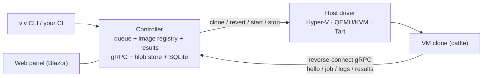

# Vivarium

**A test farm for real operating systems.** Vivarium runs your test corpus against a fleet of snapshot-managed virtual machines — Windows at an exact patch level, Windows with a specific third-party product installed, Ubuntu, macOS — and turns the results into a single *test × OS-configuration* matrix.

A vivarium is an enclosure that keeps organisms under controlled conditions for observation. This one keeps operating systems.

> **Status: design phase.** There is no runnable code yet. The design is documented in
> [`docs/ARCHITECTURE.md`](docs/ARCHITECTURE.md) (the shape), [`docs/ROADMAP.md`](docs/ROADMAP.md) (the order),
> and [`docs/prior-art.md`](docs/prior-art.md) (what we learned from the systems that came before).

## Why

CI matrixes answer *"does it pass on windows-latest and ubuntu-latest?"*. They cannot answer the questions that actually bite desktop software:

- Does it work on Windows 10 **19044 specifically**, before patch X landed?
- Does it survive on a machine where **product Y v1.2** is already installed?
- Does it behave with **no network at all**? On a pristine machine with **no runtimes installed**?
- Does the installer/overlay/input path work in a **real interactive desktop session**?

Answering those requires real OS installations with versioned, restorable state — virtual machines reverted to a pristine snapshot before every run. Vivarium is the controller, the guest agent, and the image registry that make that loop boring.

## How it works

- **Controller** — one process: job queue, versioned image registry, scheduler, result store, web panel. Think TeamCity, except agents are cattle and the first-class entity is the *image*.
- **Host drivers** — reduced to four verbs per hypervisor: clone, revert, start, stop. Everything else happens over the agent channel, which is why adding a hypervisor is cheap.
- **Guest agent** — deliberately dumb, reverse-connects to the controller over gRPC. Only a tiny frozen *bootstrap* is baked into images; the agent itself is pulled at boot, so agent updates never require rebuilding snapshots.
- **Jobs** — files in → process → exit code + files out. NUnit (self-contained, TRX) is the default payload; anything that produces JUnit XML (e.g. `cargo nextest`) plugs into the same pipe. Guests stay pristine: no SDKs, no runtimes.
- **Images** — built as *base → declarative provisioning recipe → sealed snapshot*, versioned, with drift detection. Provisioning runs through the same job machinery; a memory-state snapshot makes revert-to-pristine a matter of seconds.

## Planned features

- Test matrix across Windows / Linux / macOS guests with per-scenario network profiles (NAT / offline / full).
- Snapshot-with-memory revert per job; linked clones for parallelism.
- Image registry UI: lineage, versions, actual-vs-declared OS build (drift detection), snapshot chains.
- Declarative image recipes in git, including honest `manual` steps for software with no silent installer.
- Interactive-desktop guests by default (autologon, unlocked session) — input, overlay, and UI tests are first-class.
- Debugging affordances: keep-VM-on-fail, snapshot-the-corpse, console access, crash dumps, failure screenshots.
- `viv exec --image win10-19044 -- <cmd>` — ad-hoc commands on a pristine clone of any image.

## Non-goals

- Not a CI server — your CI calls Vivarium through the CLI/API and gets a matrix back.
- Not container-based — the whole point is real OS installations: patch levels, drivers, desktop sessions, macOS.
- Not a general-purpose VM manager — it manages exactly what the test loop needs.

## License

[MIT](LICENSE)
