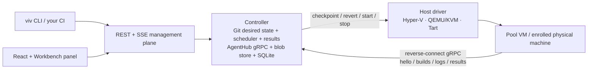

# Vivarium

**A test farm and AgentExplorer fleet manager for real operating systems.** Vivarium uses one cross-platform agent for
TeamCity-style jobs and for safe fleet inspection/operations across physical machines and, later,
snapshot-managed VMs. Test runs become one centralized *test × OS-configuration* matrix.

A vivarium is an enclosure that keeps organisms under controlled conditions for observation. This one keeps operating systems.

> **Status: Phase 1 foundation.** The pinned-TLS agent ↔ controller loop now has persistent
> registrations, TeamCity-style status axes and reported/custom parameters, heartbeats, a durable
> compatible-agent build queue, queue-wait deadlines, controller-restart-safe
> assignment/cancellation/result handshakes, protected Agents and Queue & Builds panels, a scoped
> ControlPlane API, and working `viv login`, `viv run`, and explicit durable `viv cancel` clients with
> hardened payload archives, immutable assigned-agent provenance, and centralized per-cell
> results/artifact downloads, bounded durable TRX projection, and the first D30 per-Agent central
> upgrade path (immutable packages, authenticated delivery, drain/health/rollback, REST/CLI). Install
> one-liners, fleet rollout UI/policy, broader result presentation/adapters, and provider integrations are still in
> progress; this is not an end-user release yet.
> The design is documented in
> [`docs/ARCHITECTURE.md`](docs/ARCHITECTURE.md) (the shape), [`docs/ROADMAP.md`](docs/ROADMAP.md) (the order),
> [`docs/design/README.md`](docs/design/README.md) (focused subsystem designs),
> [`docs/roles/README.md`](docs/roles/README.md) (AI expert routing),
> [`docs/prior-art.md`](docs/prior-art.md) (what we learned from the systems that came before), and
> [`docs/walkthrough.md`](docs/walkthrough.md) (what using it will feel like, end to end).

## Why

CI matrixes answer *"does it pass on windows-latest and ubuntu-latest?"*. They cannot answer the questions that actually bite desktop software:

- Does it work on Windows 10 **19044 specifically**, before patch X landed?
- Does it survive on a machine where **product Y v1.2** is already installed?
- Does it behave with **no network at all**? On a pristine machine with **no runtimes installed**?
- Does the installer/overlay/input path work in a **real interactive desktop session**?

Answering those requires real OS installations with versioned, restorable state — virtual machines reverted to a pristine snapshot before every run. Vivarium is the controller, the guest agent, and the image registry that make that loop boring.

## How it works (target architecture)

- **Controller** — one process with two product planes over the same fleet. TeamCity mode owns projects,
  build configurations, queues, builds, and centralized results. AgentExplorer mode owns host inventory and
  explicit remote operations outside builds. REST is the public management plane; desired configuration
  is committed to Git, while runtime state, secrets, logs, and results remain durable operational data.
- **Host drivers** — a handful of verbs per hypervisor: create pool VM, checkpoint, revert, start, stop, destroy. Everything else happens over the agent channel, which is why adding a hypervisor is cheap.
- **Agents** — deliberately dumb, reverse-connect to the controller over gRPC; they live in pooled pristine VMs *and* on enrolled physical machines. The target is a tiny frozen *bootstrap* installed once (baked into images, or through authenticated setup on a physical box), with the real agent pulled and upgraded centrally, TeamCity-style. D30's authenticated per-Agent activation/rollback path now runs; installer trust, fleet orchestration, and the remaining cross-platform freeze evidence are still gates (D2, D21, D30).
- **Builds** — files in → steps → exit codes + files out. NUnit (self-contained, TRX) is the default payload; anything that produces JUnit XML (e.g. `cargo nextest`) or speaks TeamCity service messages plugs into the same pipe. Guests stay pristine: no SDKs, no runtimes. *Pristine* itself is a per-configuration clean policy — revert-to-snapshot where the machine supports it, plain reboot or nothing where it doesn't.
- **Images** — built as *base → declarative provisioning recipe → sealed disk*, versioned, with drift detection. Provisioning runs through the same build machinery; pooled VMs with per-VM memory checkpoints make revert-to-pristine a matter of seconds.

## Planned features

- Test matrix across Windows / Linux / macOS guests with per-scenario network profiles (NAT / offline / full).
- Physical machines as first-class agents: enroll → authorize → they are scenarios too.
- Checkpoint-with-memory revert per build; pooled pristine VMs for parallelism; machine-provider seam for short-living cloud instances (Azure) later.
- Image registry UI: lineage, versions, actual-vs-declared OS build (drift detection), snapshot chains.
- Declarative image recipes in git, including honest `manual` steps for software with no silent installer.
- Interactive-desktop guests by default (autologon, unlocked session) — input, overlay, and UI tests are first-class.
- Debugging affordances: keep-VM-on-fail, snapshot-the-corpse, console access, crash dumps, failure screenshots.
- `viv exec --image win10-19044 -- <cmd>` — ad-hoc commands on a pristine clone of any image.
- Portable everything: self-contained single-file binaries, xcopy deploy, air-gap friendly — the controller bundles and serves the agent packages itself, and agents auto-update from it.

## Non-goals

- Not a source-control pipeline orchestrator — Vivarium can be called by CI, but its TeamCity-style job
  runner is also useful directly for tests and future builds.
- Not container-based — the whole point is real OS installations: patch levels, drivers, desktop sessions, macOS.
- Not an unrestricted RMM/configuration-management system — AgentExplorer exposes only explicit,
  capability-negotiated, authorized, audited operations.

## License

[MIT](LICENSE)
