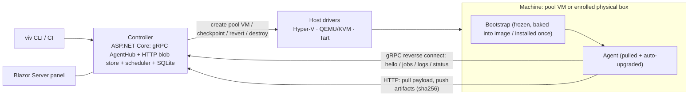

# Vivarium Architecture

> This document holds the *shape* of the system; [`AGENTS.md`](../AGENTS.md) holds the *rules* for working on it.
> Status: **design phase** — everything here is a decision record, not a description of running code.
> When a decision changes, this file changes in the same commit.

## 1. Problem and goals

Vivarium runs test corpora against many operating-system configurations: Windows 10/11 at an exact
patch level, Windows with specific third-party software preinstalled, Ubuntu, macOS. Every run starts
from a pristine, versioned machine state, and results land in one *test × scenario* matrix.

Goals, in priority order:

1. **Reproducible machine state.** An image-backed scenario is a versioned, sealed snapshot; a
   pristine build always starts from it. Physical scenarios trade reproducibility for realness —
   deliberately (D16).
2. **Central control.** One controller with a web panel: queue, fleet, image registry, results. Monitoring a farm by hand does not scale past two VMs.
3. **Payload-agnostic builds.** NUnit/.NET is the default test vehicle, but the runner contract must fit anything — Rust test binaries, plain scripts, one-off commands.
4. **Cheap scenario authoring.** Adding "Win10 19044 + product X v1.2" is a small recipe diff plus one build command, not an afternoon of clicking.

Non-goals:

- Not a CI server. CI (TeamCity, GitHub Actions, anything) calls Vivarium via CLI/API and consumes the matrix.
- Not container-based. Real OS installs are the point: patch levels, drivers, services, interactive desktop sessions, macOS.
- Not a general VM manager. Only the operations the test loop needs.

## 2. Core model

Vivarium adopts TeamCity's model **wholesale — entities, statuses, and semantics** — and gives it an
automation-first spin: builds run bulk test corpora across machine *conditions*, and the machine side
grows providers, a pristine lifecycle, and an image registry. TeamCity even contains the seed of our
split already: regular agents (installed once, authorized, auto-upgraded) vs cloud profiles (agents
spawned from images on demand, auto-authorized, discarded after idle). Vivarium generalizes the second
into machine providers (D15) and adds what TeamCity never had: versioned images with sealed snapshots
and revert-to-pristine before a build.

| TeamCity | Vivarium |
|---|---|
| Project / Build Configuration / Build | Same, verbatim (D14) |
| Build Queue; agent requirements vs agent parameters | Same, verbatim |
| Agent status: connected × authorized × enabled × idle/building | Same, verbatim (D8) |
| Agent auto-upgrade from the server | Same — launcher handshake (D2) |
| Regular agents | **Enrolled agents**: physical boxes, long-lived VMs (D16) |
| Cloud profiles / cloud agents | **Machine providers**: hypervisor (clones of ImageVersions), cloud, static pool (D15) |
| Service messages `##teamcity[…]` | Same, verbatim (D14) |
| Artifacts / build log | Content-addressed blob store / streamed log |
| Investigations & muted tests | Planned: matrix triage — mute a test × scenario cell |
| — | **Image registry + pristine clean policy**: sealed versioned snapshots, recipes, drift detection |

Agents may be pets *or* cattle: an enrolled physical machine is a classic TeamCity agent; a
provider-spawned clone lives for exactly one build. **Pristine is a capability and a clean policy
(D5), not the only lifecycle** — a build configuration that just wants a real connected machine runs
on one, as is.

## 3. Components

One controller process, thin drivers, deliberately dumb guests.



- **Controller** (`Vivarium.Controller`): build queue, image registry, scheduler, machine providers, agent rendezvous (gRPC), blob store, result store (SQLite), Blazor Server web panel. One Kestrel host serves all of it.
- **Machine providers** (D15): supply agents to the queue — a static pool of enrolled machines (physical boxes, hand-managed VMs), hypervisor providers that maintain pools of pristine VMs per `ImageVersion` (host drivers live here), and later cloud providers for short-living instances.
- **Host driver** (per hypervisor): `CreatePoolVm(imageVersion)`, `Start`, `Stop`, `TakeCheckpoint`, `RestoreCheckpoint`, `Destroy`, `GetConsoleEndpoint`. Nothing else — no guest file copy, no guest exec (see D1). In-process .NET implementations first; if third-party drivers ever appear, garm's external-executable provider contract is the sanctioned escape hatch.
- **Bootstrap** (`Vivarium.Bootstrap`): the only thing baked into images. Frozen contract (§7).
- **Agent** (`Vivarium.Agent`): pulled by bootstrap at boot; executes jobs, streams logs, uploads results. Deliberately dumb — all decisions live in the controller.
- **CLI** (`Vivarium.Cli`, binary `viv`): submit builds, ad-hoc exec, status, authorize — a client of the `ControlPlane` gRPC service (§5). The panel is in-process Blazor Server and needs no API; the CLI is also the CI integration point.
- **Contracts** (`Vivarium.Contracts`): the `.proto` files and generated types shared by all of the above.

## 4. Key decisions

Numbered so later docs and commits can reference them.

### D1. Agents reverse-connect; drivers stay minimal

The controller never reaches *into* a guest (no SSH, WinRM, PowerShell Direct, guest-ops APIs — every
hypervisor has a different zoo of these). Instead the guest agent dials out to a well-known controller
address after boot: hello → receive build → pull payload → stream logs → push results. This is the model
every CI agent uses, and it collapses the per-hypervisor driver surface to the small §3 verb set —
which is exactly why adding QEMU or Tart later is cheap. No IP discovery, no firewall pain, no guest
credentials. Physical machines make this non-negotiable: there is no hypervisor to reach through at all.

### D2. Only a frozen bootstrap is baked into images

Baking the agent into snapshots means every agent bugfix rebuilds every snapshot — the #1 operational
pain of VM farms. Images carry only a tiny **bootstrap** with a frozen contract (§7); the real agent is
downloaded from the controller at boot (manifest + sha256), so agent updates are "publish a file".
The controller can tell a running agent to restart (`RestartAgent`), and bootstrap picks up the new version.

The handshake is TeamCity's: on hello the controller compares agent versions and orders a restart when
stale. On physical machines this is the *only* update path — install once by hand, upgrade centrally
forever — which is why bootstrap must stay boring. Pool checkpoints may carry yesterday's agent; the
post-revert upgrade costs one small LAN download **and an agent process restart, not a reboot** —
pool VMs never reboot between builds (D5). Periodic maintenance re-checkpoints pool VMs with the
current agent (D13); no image rebuild involved.

### D3. The build contract is files-in / process / files-out

The runner does not know what NUnit is. A build is: a payload **archive** (sha256-addressed; file
modes and symlinks preserved — loose per-file blobs lose the executable bit the moment a Linux agent
unpacks them) → unpack with path-traversal hardening (the agent runs elevated; a hostile archive must
not write outside the workdir) → run steps (commands with env/cwd/timeout, D14) → collect declared
globs → exit codes. *Result adapters* on the controller
side parse well-known formats into the result model:

- **Default payload — NUnit on .NET**, published **self-contained** per RID, executed as a plain exe
  producing TRX (Microsoft.Testing.Platform route; NUnitLite is the classic fallback). No SDK or runtime
  is ever installed in guests — a "pristine customer machine" stays pristine.
- **Rust** plugs into the same pipe: `cargo nextest archive` + the static nextest binary shipped inside
  the payload, JUnit XML out.
- Tests that drive an arbitrary SUT treat it as just another payload artifact; the agent passes
  `VIVARIUM_SUT_PATH`, `VIVARIUM_SCENARIO`, `VIVARIUM_RESULTS_DIR` env vars.

**Payload portability doctrine** — "no runtimes in guests" cuts both ways; payloads must be built for
pristine machines: Rust/MSVC binaries with `crt-static` (or they silently die on a machine without the
VC++ redist), self-contained .NET with `InvariantGlobalization` or bundled ICU for minimal Linux, a
documented glibc floor, cross-published macOS binaries verified to carry at least ad-hoc signatures
(smoke-tested in Phase 0), and `cargo nextest` archives shipped **with the source tree** and run with
`--workspace-remap` — nextest requires the workspace layout on the target; a static nextest binary
alone is not enough. TRX output requires the `Microsoft.Testing.Extensions.TrxReport` package in the
test project.

### D4. gRPC control plane, plain-HTTP data plane

One bidirectional gRPC stream per agent (`Session`) carries hello, build assignment, status, log
chunks, heartbeats. Bulk data — payloads and artifacts — moves over plain HTTP on the same Kestrel
host (`GET/PUT /blobs/{sha256}`): idempotent and retryable, deduplicated by construction, debuggable
with curl, and free of gRPC message-size ceilings. Blob and bootstrap endpoints carry the same bearer
tokens as gRPC — nothing is anonymous. Tokens are scoped: **agent** (session + blobs), **submit**
(what CI gets: run builds, read results), **admin** (authorize agents, manage images, ad-hoc exec).
A CI secret must not be able to `viv exec` on a dev box. The panel authenticates the same way — the
admin token is exchanged once at a login page for an auth cookie; a page that can authorize agents is
never an open page. And the blob store defends itself: the server verifies that a `PUT /blobs/{sha256}`
body actually hashes to its name — a content-addressed cache an agent can poison is worse than none.

Two consequences of memory-restore drive transport details:

- **Guest clocks wake up in the past**, which breaks ordinary TLS validation — including the agent's
  own connection. The answer is **pinned TLS from day one, not cleartext**: the controller generates a
  self-signed certificate at first run; its fingerprint travels in the enroll one-liner and in
  `bootstrap.json`; agents validate by pinned fingerprint with a callback that ignores validity dates.
  This authenticates the server to elevated agents on a routable LAN (physical machines, D16, made the
  old "isolated host-only network" premise obsolete) *and* survives warped clocks. Additionally, the
  controller returns its wall-clock in `Welcome` (§5) and with every build assignment, and the
  elevated agent corrects guest skew immediately — Cuckoo has shipped exactly this `clock` parameter
  for fifteen years.
- **The agent's TCP connection is dead after restore but doesn't know it.** gRPC keepalive pings
  (~10 s interval / 5 s timeout) on both sides detect it in seconds; the agent treats any disconnect
  as "reconnect and re-hello". A re-hello carries the build the agent still believes it is running, so
  the controller **re-adopts or aborts** the ghost instead of double-scheduling next to it; every
  retry is fenced on the agent's `session_id` — a nonce regenerated at every (re)connect, because a
  pool VM resumes the *same OS boot* across reverts (D5) and a per-boot id would never change — and
  result submission is idempotent on `(build_id, session_id)`: a stream that dies between artifact
  push and `BuildResult` cannot make a build both pass and retry. A lease lost past its timeout is an
  INFRA failure (D9).

### D5. Pristine is a clean policy; its revert point is a memory snapshot

Per build configuration (or machine), the **clean policy** is one of: `pristine` (revert to the
machine's pristine checkpoint before the build — requires checkpoint capability), `reboot` (the honest reset physical
machines can offer), `clean-workdir`, or `none` (run on the connected machine as-is — plain TeamCity
behavior). Configurations state what they need through ordinary agent requirements; checkpoints are
first-class, not mandatory. The rest of this decision describes how `pristine` works on managed VMs.

`pristine` is implemented with **pool VMs**, not clones-of-a-snapshot. A hypervisor cannot cheaply
clone a *memory* checkpoint: Hyper-V import copies the multi-GB runtime state per copy, a NIC's MAC
cannot change while a VM holds saved state, and a restored memory image still carries the donor's MAC
inside the guest network stack — the naive "seal once, clone N ways" design bricks networking on day
one. So the unit is a pool: for each `ImageVersion` the provider pre-creates N persistent VMs —
differencing disks off the sealed parent VHDX/qcow2 are the genuinely instant, near-free part — and
each pool VM boots once *as itself* (own MAC, own hostname), reaches the logged-in idle state, and
takes **its own** memory checkpoint. Revert = restore-own-checkpoint: honestly ~2–5 s to a live agent
instead of a 30–90 s cold Windows boot. Pool capacity is the parallelism knob and grows in the
background (one first-boot per added VM). Cold boot remains a per-scenario option — boot-time behavior
is itself worth testing. Sizing reality: a 32 GB host runs ~5–6 Windows pool VMs at 2 vCPU / 4 GB —
fewer when the host doubles as somebody's dev machine.

Hyper-V specifics the model depends on — pinned in the driver, because they are not the defaults:
**Standard** checkpoints (the modern default is Production: VSS, no memory state, applies to *off* —
which silently degrades "2–5 s" into a cold boot), automatic checkpoints disabled, **static memory**
(dynamic memory can fail a restore under host pressure, and memory size is scenario identity anyway),
static MAC. A revert resumes the *same OS boot* — pool VMs never reboot between builds, so per-boot
identifiers cannot fence anything (D4) and the guest wakes with stale DHCP/ARP/TCP state: the agent's
post-restore ritual is clock fix (D4), then network refresh (DHCP renew / ARP flush), then reconnect.
QEMU's `savevm` writes guest RAM into the qcow2 — expect tens of seconds per revert, not Hyper-V-class
latency. Tart has no checkpoints at all and runs the clone-per-build lifecycle instead (D15, §10).

### D6. Provisioning is a build with a different epilogue

A build's epilogue is one of: **revert** (pristine builds), **none** (persistent machines — plain
TeamCity behavior), **keep** (debug quarantine), or **seal** (provisioning). Sealing is **disk-only**
(§8.3): the provision VM's checkpoints are deleted (an online merge), it shuts down cleanly, and its
disk chain is merged into a **standalone parent VHDX** registered as the new `ImageVersion` — flat
parents beat diff-on-diff version chains, whose read amplification grows with every generation. A
provision build runs on a fresh dedicated VM created from the parent version and consumed by the seal —
never on a serving pool VM. Sealed parents are immutable forever: Hyper-V invalidates every child of a
touched parent, so "patch the parent" is always "new ImageVersion + rebuild pools" (§8.3).

Provisioning steps may legitimately reboot the machine (installers do). Such steps are marked
`expected-reboot`, which suppresses D9's lost-heartbeat INFRA classification and re-adopts the build
on the agent's next hello (D4) instead of retry-storming half-provisioned VMs.

One machinery for everything; there is no separate "image builder" tool. Recipes are declarative files
in git (§8.2), including honest `manual` steps for software that cannot be installed silently.

### D7. Agent identity: pool VMs and enrolled machines

Provider-managed pool VMs (D5) have stable identity by construction — each is a persistent VM the
controller created, with its own MAC and hostname known up front, so "which VM just said hello?"
answers itself; the agent still reports its MAC and a per-connect `session_id` nonce in `Hello` as a
cross-check and for fencing (D4). Pool agents are **auto-authorized** — but authorization must rest on
more than self-reported claims: the provider verifies the connection against **host-side facts** (the
hypervisor knows each pool VM's MAC and switch port without any guest channel — reading them breaks no
D1 rule) and a per-VM nonce injected at `CreatePoolVm` time (Hyper-V KVP, QEMU fw_cfg) and echoed in
`Hello`. An `image_id` anyone can type is not an identity.

Enrolled agents — physical machines, long-lived VMs — carry a persistent identity instead: a GUID
generated at install plus an authorization token issued when the operator authorizes them, delivered
over the live session in an explicit `AuthorizationGranted` message (§5) — `Welcome` only reports the
current status at connect time. One name everywhere: the token is `auth_token` in `Hello` and in
`AuthorizationGranted`. The agent stores its identity and token in its own data directory, never in
`bootstrap.json` (§7).

### D8. Agent status is TeamCity's; machine lifecycle is Vivarium's

Two separate layers, deliberately.

**Agent status — TeamCity 1:1.** Four independent axes: *connected/disconnected* (a network fact),
*authorized/unauthorized* (an operator decision — unauthorized agents connect and are visible but
never receive builds), *enabled/disabled* (an operator toggle), *idle/building/upgrading*.
Compatibility is computed per build configuration from requirements vs agent parameters, exactly as
TeamCity does. These statuses are mandatory, first-screen information.

**Machine lifecycle — managed machines only.** Pool VMs additionally walk an explicit conveyor:
`CREATING → FIRST_BOOT → CHECKPOINTING → READY → BUSY → COLLECTING → REVERTING → READY … → DESTROYING`,
plus `SEALING` (provisioning) and `QUARANTINE` (keep-on-fail); clone-per-build providers (D15) walk
the degenerate form `CREATING → FIRST_BOOT → BUSY → DESTROYING`. Every transition is timestamped and
has a timeout; "stuck in FIRST_BOOT for 120 s" is an INFRA alert and an automatic recycle. Physical
machines have no conveyor — their recycle is a reboot, or an operator. `on_fail: keep` on a physical
machine preserves the workdir and flags the build for inspection but does not quarantine the box — a
capacity-1 machine cannot be held hostage by one red build; the operator's *disable* toggle exists for
deliberate quarantine.

Following LAVA, *health* (good / bad / maintenance / retired — set by canaries and operators) is a
third, orthogonal axis: a canary failure marks an image version, machine, or host bad and removes it
from scheduling without touching in-flight builds. Together these three layers are the scheduler
skeleton, the main panel view, and the alerting source — what makes "monitoring the farm" tractable.

### D9. Failure taxonomy: INFRA / TEST / CRASH

- `INFRA` — no hello, lost heartbeat, revert failure, timeout before the payload ever ran. Retried
  silently — on another clone, or after a reboot on a physical machine; never shown as a test failure.
- `TEST` — the payload ran and reported failures (TRX/JUnit). Never auto-retried.
- `CRASH` — nonzero exit without a result file; dumps collected.

Mixing infra noise into test results is the fastest way to make the matrix untrustworthy; the taxonomy
is enforced in the data model, not by convention. Prior art converges here: GitLab's custom-executor
contract separates `BUILD_FAILURE` from `SYSTEM_FAILURE` exit codes and auto-retries only the latter;
syzkaller classifies merged console+process output into crash / lost-connection / no-output with typed,
bounded-retry infra errors.

### D10. Guests run an interactive desktop by default

Input synthesis, overlays, foreground windows, and installers need a real unlocked session. Images are
built with: autologon, agent launched as a logon task of that user, **elevated** (UAC off or
highest-available — a non-elevated agent can neither fix the clock nor send input to elevated windows
past UIPI), screen lock/screensaver disabled, fixed resolution. Session type is reported in `Hello`; build configurations
can require `interactive`. Enrolled physical machines intended for UI tests follow the same checklist
by hand — the agent reports the truth either way.

Platform realities that live here rather than in anyone's imagination: **macOS TCC** — Accessibility /
Input Monitoring / Screen Recording grants cannot be scripted by any one-liner; they are manual
System-Settings work, done once per enrolled Mac and once per macOS image before sealing. **Console
access to UI state**: connecting to a Hyper-V VM in enhanced session mode opens an RDP-style
*separate* session — inspecting a quarantined UI failure through it can destroy the very session state
you came to see; use basic mode for inspection, and run `manual` provisioning steps (§8.2) in basic
mode too, or they get sealed into an RDP session. **Headless physical boxes** render no real desktop —
UI/overlay behavior diverges without a display, so a dummy plug or virtual display adapter is part of
the machine checklist. **Linux**: input synthesis is straightforward on X11 and restricted under
Wayland — UI-test images prefer an X11 session until a Wayland story exists.

### D11. Drift detection

The agent reports the *actual* OS build in `Hello`. If an image claims 19044 and the guest reports
19045, Windows Update leaked through — the panel flags the image version red instead of silently
poisoning the matrix. Images are built with updates/telemetry disabled and Defender exclusions for the
work directory (unless "AV enabled" *is* the scenario — then it is a scenario axis, §8.2).

### D12. Debugging affordances are first-class

- **WER LocalDumps** (Windows) / `core_pattern` (Linux) preconfigured in images — crash dumps of the SUT collect themselves.
- **Screenshot on failure** taken by the agent.
- **keep-on-fail**: the pool VM moves to `QUARANTINE` instead of being reverted (its pool backfills); connect via console.
- **snapshot-the-corpse**: optionally snapshot the VM *at the moment of failure* — the failed state
  becomes revertable-to later. Nearly free with this machinery; almost nobody offers it. Corpses pin
  their VM's disk chain, so they carry a retention budget (count + age), not an eternal freeze.
- **Console access**: the driver exposes a console endpoint (Hyper-V `.rdp` / vmconnect, VNC for
  QEMU/Tart). An embedded web console is a later nicety.

### D13. Fleet maintenance is scheduled work, not heroics

Checkpoint chains and pool diff disks grow; blobs accumulate; images rot. The controller schedules:
periodic pool re-baseline (rebuild pool VMs from the sealed parent), disk compaction, blob GC,
checkpoint pruning, and **health-check canary
builds** — a trivial boot-hello-run build per image version on a cadence, so a rotten image is caught
by a canary, not by a real run at 2 a.m. Host disk/CPU/RAM are shown on the panel with alerts. Blob GC is
reference-counted with a grace window (an in-flight `PUT` or a just-submitted build must not race
collection), and retention is explicit: blobs referenced by retained builds are never collected —
"a historical cell never silently changes meaning" (§6) is a retention policy, not a hope.

### D14. The work model is TeamCity's, names included

`Project` → `Build Configuration` (steps, requirements, parameters, artifact rules) → `Build`
(queued → running → finished), scheduled from a `Build Queue` onto compatible agents. A scenario
matrix expands into a **matrix build** whose cells are ordinary builds, aggregated composite-style.
Steps have execution policies (default / even-if-failed / always) so diagnostics collection runs even
after a failing test step. A cell whose requirement matches no known agent **fails fast at submit**
("no compatible agents") instead of queueing forever, and queue-wait has its own timeout, separate
from the run `timeout:`. Earlier drafts of this document said Suite/Run/Job; the adopted names are
build configuration / matrix build / build.

Live progress uses **TeamCity's service-message protocol verbatim**: the agent scans step stdout for
`##teamcity[testStarted …]` / `testFailed` / `progressMessage` / … and forwards them as structured
events. Every reporter that already speaks TeamCity — NUnit's TeamCity listener, pytest-teamcity,
Gradle, dozens more — becomes a live Vivarium progress source with zero integration work. Authoritative
results remain the collected TRX/JUnit files (D3); service messages only stream the build as it runs.

Two adapter realities: (1) per-test history needs **stable test identity** across scenarios —
parameterized NUnit test names can vary by culture and OS (a `tr-TR` locale axis will rename tests
unless identity is normalized adapter-side); (2) service messages arrive on payload-controlled
stdout — forgeable, interleaved, split across chunks — so the parser treats them as progress hints
only, never as results, and handles escaping and partial lines defensively.

### D15. Machines come from providers

The scheduler asks `MachineProvider`s for capacity; a provider implements
`Acquire(requirements) → machine` / `Release(machine)`:

- **Static pool** — enrolled machines (physical boxes, hand-managed VMs). Capacity is what it is.
- **Hypervisor provider** (Hyper-V / QEMU / Tart) — maintains a pool of pristine VMs per sealed
  `ImageVersion` (D5): reverts a pool VM before each build, grows or drains pools as the queue
  demands, within host caps. TeamCity's cloud-profile logic verbatim, with checkpoints added; pool
  agents are auto-authorized against host-side identity (D7). Providers declare a **lifecycle mode**:
  *revert-pool* (Hyper-V, QEMU) or *clone-per-build* (Tart — no checkpoints today; `tart suspend` on
  macOS 14+ may enable pools later; cloud providers are clone-per-build by nature). Same seam, two
  honest lifecycles.
- **Cloud provider** (Azure first; later) — short-living instances from cloud images; the agent is
  baked into the image or installed by an init script and reverse-connects like everyone else. Not in
  the first release, but the seam exists from day one — GitLab's fleeting and garm validated exactly
  this scaler-vs-provider split (see prior-art).

### D16. Physical machines are first-class

A physical box is enrolled with the same one-liner, authorized like any TeamCity agent, and described
by its parameters — it *is* a scenario, with capacity 1 and no pristine capability. Its clean policies
are `reboot` / `clean-workdir` / `none`; INFRA failures mark it bad and notify instead of recycling —
there is nothing to recycle. Later options for pristine-on-metal: PXE re-imaging or disk-restore
tooling, plus WoL/IPMI power management. Builds on physical cells record the agent's full parameter
snapshot in place of an `ImageVersion` (§6).

### D17. Build configurations are code in the tested repo

`vivarium.yaml` lives next to the code it tests; `viv run` submits it together with payload blobs
(sha256-deduped upload). The panel authors the *fleet* — agents, images, pools — and shows results; it
does not author test configurations in v1. Automation-first means the run definition versions with the
product, GitHub-Actions-style, rather than living in server-side UI state. Named matrix cells select
agents via requirement expressions (`os.family == windows`) or, from Phase 2, images
(`image: win10-19044-clean`); template variables (`{rid}`, `{os}`, `{arch}`, `{exe}`, `{results}`)
specialize payload paths and steps per cell so one definition covers every OS — with one rule: `{rid}`
used in `payload:` must resolve at upload time, so cells shipping RID-specific payloads declare `rid:`
explicitly instead of hoping the matched agent implies it. `viv run` waits by default and exits
nonzero on any red cell — CI integration is an exit code, not a plugin (`--no-wait` opts out).
[`walkthrough.md`](walkthrough.md) is the normative UX for all of this.

### D18. Scenarios are environment × parameters × repetition

The matrix is not an OS list. A **scenario** — the named unit that becomes a matrix column and a rerun
target — is a machine selector (`agent:` expression or `image:`) *plus* a parameter bag *plus* an
optional repeat count. Two definition styles normalize to the same thing: cross-product axes
(`matrix:` with `exclude:`/`include:` pruning, GitHub-Actions-style — the machine axis is just one
axis among value axes) and an explicit named `scenarios:` list for hand-picked combos. Parameters
reach the build as `{param.*}` template variables and `VIVARIUM_PARAM_*` environment variables;
selecting a test subset per scenario is just an argument (`--filter {param.suite}`), not machinery.
Each cell build records its scenario name, resolved parameters, and iteration index alongside "what it
ran on" (§6).

`repeat: N` is first-class (flake hunting, stress): every iteration is an ordinary build; the matrix
cell aggregates them into a pass rate (47/50), and `viv run --repeat N` overrides ad hoc. Repeats on
pristine cells are truly independent runs — that combination is the honest flakiness detector. Several
scenarios matching the same persistent agent serialize on its queue (TeamCity semantics); image-backed
scenarios fan out across the image's pool instead. Guardrails are part of the design: per-configuration
concurrency caps and queue priorities keep a `repeat: 50` cell from starving every other scenario on
the only matching box.

The boundary with in-test parameterization stays sharp: values only the test process cares about
belong in NUnit `[TestCase]`; Vivarium parameterizes what the process cannot — the environment, the
invocation, the machine. Naming follows from the matrix itself: *rows* are already test cases (the
payload framework's, with per-test history across scenarios), so the columns are *scenarios*, not cases.

Cell identity is the scenario name *plus* the machine it resolved to: when an expression cell starts
matching a different machine, history and pass rates do not silently blend — the matrix badges the
change (§6).

### D19. Everything ships portable; the controller is the distribution point

All four binaries — controller, agent, bootstrap, `viv` — are self-contained single-file .NET
publishes per RID: no installers, no registry, no machine-wide state. Config and data live beside the
executable, uninstall = delete the folder, and admin rights are needed only for elevated/autologon
*duties* (D10), never just to run. GitHub Releases carry the zips plus `SHA256SUMS`
([`DEVELOPMENT.md`](DEVELOPMENT.md) has the pipeline); code signing is deferred and recorded (§13).

At runtime the farm depends only on itself: the controller **bundles the agent + bootstrap packages
for every supported RID** and serves them from its own store — `/bootstrap/manifest` (D2), the
panel's Downloads page, and the enroll scripts all read from that store, so an air-gapped farm never
phones GitHub. The store also accepts side-loaded builds: `viv agent push out/agent/win-x64` (admin
scope) publishes a dev build, and every agent picks it up at its next restart — the core dev loop for
agent work is build → push → watch the farm swap in seconds.

The downloadable agent zip is the enrollment fallback for machines where the one-liner is awkward (no
LAN route yet, air-gap, USB-stick provisioning): unzip, then `vivarium-agent enroll --url … --fp …
--token …` — `enroll` is an *agent* verb that writes `bootstrap.json` and registers the logon task,
so bootstrap stays the frozen dumb loop (§7). Running the agent interactively in a console is a
first-class mode for debugging.

### D20. Four test tiers; the hypervisor is faked until it can't be

(1) **Logic tests** — NUnit on Microsoft.Testing.Platform, the same stack payloads use: scheduler and
compatibility matching, matrix expansion, adapters against golden files, blob GC, fencing — with
**virtual time**, so lease and queue timeouts never sleep. (2) **In-process protocol tests** — a real
Kestrel controller on a loopback port plus real agent child processes: Session/Welcome, enrollment,
authorization, upgrade handshake, reconnect-and-re-adopt, result idempotency. Phase 0's "session loop
alive" is this suite's first member, not throwaway code. (3) **FakeMachineProvider** — simulated pool
VMs backed by local agent processes (revert = process restart + workdir reset) drive the full D8
conveyor deterministically with zero hypervisors. (4) **Real-hypervisor E2E** — QEMU/KVM smoke on
GitHub's hosted Linux runners once that driver exists (they expose `/dev/kvm`; hosted Windows runners
cannot do Hyper-V), and Hyper-V E2E on a self-hosted runner: the dev machine first, later the farm
itself.

Two structural consequences: protocol backward-compatibility is enforced by CI running the tier-2
suite against the **previous release's agent binaries** (the HLK lock-step lesson), and from Phase 1
Vivarium dogfoods — the repo's own `vivarium.yaml` runs the suite across the farm, with canary builds
gating agent rollouts. Details and CI mapping: [`DEVELOPMENT.md`](DEVELOPMENT.md).

## 5. Protocol sketch

```proto
syntax = "proto3";
package vivarium.v1;

service AgentHub {
  rpc Session (stream AgentMsg) returns (stream ControllerMsg);
}

message AgentMsg {
  oneof msg {
    Hello hello = 1;
    StepStatus status = 2;     // FETCHING / RUNNING step N / COLLECTING
    LogChunk log = 3;          // stdout/stderr, chunked, bounded buffering
    ServiceMessage event = 4;  // parsed ##teamcity[...] from step stdout (D14)
    BuildResult result = 5;    // per-step exit codes + sha256 list of uploaded artifacts
    Heartbeat heartbeat = 6;
  }
}

message ControllerMsg {
  oneof msg {
    Welcome welcome = 1;       // reply to Hello: server wall-clock (D4), current authorization status
    AuthorizationGranted authorized = 2;  // enrolled flow: auth_token, sent when the operator clicks Authorize (D7)
    BuildAssignment build = 3;
    CancelBuild cancel = 4;
    RestartAgent restart = 5;  // exit; bootstrap fetches the current agent version (D2)
  }
}

message Hello {
  string agent_id = 1;         // persistent GUID (enrolled) / pool-VM identity (managed)
  string auth_token = 2;       // issued at authorization; empty while unauthorized (D7)
  string enroll_token = 3;     // from the setup one-liner; consumed at first contact (§8.4)
  map<string, string> parameters = 4;  // os.build, software.*, machine.kind, pristine, ...
  string image_id = 5;         // set for pool VMs
  string session_id = 6;       // nonce per (re)connect — fencing (D4); pool VMs share one OS boot
  string mac = 7;              // identity cross-check (D7)
  string agent_version = 8;    // upgrade handshake (D2)
  OsInfo os = 9;               // ACTUAL os/build — drift detection (D11)
  bool interactive = 10;       // live desktop present
  string running_build_id = 11;  // non-empty on re-hello: ghost re-adoption (D4)
  string pool_nonce = 12;      // injected at CreatePoolVm (KVP / fw_cfg) — host-verified identity (D7)
}

message BuildAssignment {
  string build_id = 1;
  repeated Blob payload = 2;      // {url, sha256, unpack_to}
  repeated Step steps = 3;        // RunSpec + execution policy (default/even-if-failed/always)
  repeated string collect = 4;    // artifact globs
  OnFail on_fail = 5;             // NONE / KEEP_MACHINE / SNAPSHOT_MACHINE
  map<string, string> parameters = 6;  // resolved scenario params → env VIVARIUM_PARAM_* (D18)
}
```

Blob endpoints: `GET/PUT /blobs/{sha256}`. Bootstrap endpoints: `GET /bootstrap/manifest?os=&arch=`,
`GET /setup.ps1`, `GET /setup.sh` (§8.4). Everything is bearer-authenticated (D4), and the server
verifies that a `PUT /blobs/{sha256}` body hashes to its name. The enroll command carries a
short-lived, **single-use** enroll token and the certificate fingerprint as explicit arguments; the
setup script's first act is to re-validate the live TLS certificate against that fingerprint and abort
on mismatch (§8.4).

The management plane is a second, ordinary gRPC service on the same host — the CLI's contract (the
panel is in-process Blazor Server and does not need it):

```proto
service ControlPlane {
  rpc SubmitBuild (SubmitBuildRequest) returns (BuildRef);   // config + scenario selection
  rpc WatchBuild (BuildRef) returns (stream BuildEvent);     // states, cells, log tail
  rpc ListAgents (ListAgentsRequest) returns (AgentList);
  rpc AuthorizeAgent (AgentRef) returns (AgentInfo);
  rpc Exec (ExecRequest) returns (stream ExecEvent);         // viv exec --agent / --image
  rpc MissingBlobs (BlobHashes) returns (BlobHashes);        // dedup: which sha256s to upload
}
```

Build flow: the queue holds builds awaiting compatible agents → a provider supplies one (an idle
enrolled agent, or a reverted pool VM) → assignment → payload pull (sha-verified) → steps run
(log stream + service messages + heartbeats) → artifact push → result → adapters parse TRX/JUnit →
epilogue per clean policy (D5/D6).

## 6. Data model

TeamCity's entities plus the machine/image layer:

`Project` → `BuildConfiguration` (steps, requirements, parameters, artifact rules, matrix axes) →
`Build` (state, failure class per D9, log, `TestOccurrence`s, artifacts; a matrix build is a composite
aggregating its per-scenario cells). Queue rows reference builds awaiting compatible agents.

`Agent` (identity, version, status axes per D8, parameters, pool) ↔ `Machine` (kind:
`physical | managed-vm | cloud`; capabilities: pristine / console / power; conveyor state for managed
kinds) ← `MachineProvider` (static pool / hypervisor / cloud). `Host` (hypervisor node: driver,
capacity, cpu/ram/disk) → `Image` (recipe ref, lineage) → `ImageVersion` (sealed disk ref, recipe
hash, parent version, declared+actual OS build, sealed-at) → pool VMs derived from it (D5). Plus `Blob`.

Every build records what it actually ran on: the exact `ImageVersion` for image-backed cells, or the
agent's full parameter snapshot for physical cells — a historical cell never silently changes meaning,
and the matrix can show "started failing at product-X 1.2 → 1.3". It also records what it *ran*:
`BuildConfiguration` identity is `(project, name)`, the yaml is authoritative at submit time (D17),
and each build stores a hash + snapshot of the resolved definition — history keys on the name while
any drift in steps or cells is visible per build instead of silently rewriting the past.

Storage: SQLite in WAL mode with **one serialized writer channel** — agent streams, the scheduler, and
panel actions all funnel writes through it — plus a blob directory; streamed build logs land in the
blob store as chunked files. No external services.

## 7. Bootstrap contract (frozen after Phase 0)

The only code baked into images — and installed on physical machines by the setup one-liner. In role
it is exactly TeamCity's agent launcher: the version handshake and the swap live here. The contract
freezes once Phase 0 has proven it end-to-end — freezing before the first consumer exists is how a bug
gets frozen. Entirety of its behavior:

1. Read `bootstrap.json` next to itself: `{ controllerUrl, certFingerprint, machineKind, imageId? }` —
   `certFingerprint` pins the controller's self-signed TLS certificate (D4); `imageId` exists only in
   baked images. The agent's own persistent identity (GUID + authorization token, D7) lives in the
   agent's data directory, never in `bootstrap.json`.
2. Loop: `GET /bootstrap/manifest?os=…&arch=…` (pinned TLS) → `{version, sha256, url}`; if the local
   agent differs, download, verify sha256, swap atomically (temp + rename); launch the agent with the
   config; wait for exit; repeat with jittered backoff.

Self-contained single-file .NET; size is irrelevant inside a 40 GB image. Rebuilding images is required
only when the scenario's software set changes (legitimate) or bootstrap itself changes (should not happen).

## 8. Images

### 8.1 Layers

1. **Base images** — OS at an exact patch level + bootstrap + autologon + updates/telemetry off +
   Defender exclusions + WER dumps + fixed resolution. Built manually at first; unattended
   (autounattend.xml / autoinstall) later. Exact-build Windows media comes from UUP dump (operator-run;
   `rgl/uup-dump-get-windows-iso` is the automation model), and `autounattend.xml` can be generated
   from recipe fields with the embeddable MIT `cschneegans/unattend-generator` library. Pool-VM first
   boot sets a unique hostname before the checkpoint (duplicate names on one subnet are noisy — even
   though duplicate SIDs off-domain are, contrary to myth, harmless; domain-join scenarios are the
   ones that need sysprep). Windows activation is an operator concern the docs must not dodge:
   unactivated watermarks perturb UI tests, so plan KMS/MAK/eval licensing per pool (§13). Clock
   policy is per-platform: Hyper-V guests keep the TimeSync integration service (it corrects after a
   restore; the agent's `Welcome`-clock fix is the fallback), QEMU and physical machines rely on the
   agent alone, and in-guest NTP/w32time is disabled in images so a third writer never steps the clock
   mid-test (D4).
2. **Scenario versions** — base + provisioning recipe, sealed (D6) into an `ImageVersion` with a
   memory-state runtime snapshot.

### 8.2 Recipes

```yaml
# images/win10-19044-avx.yaml
parent: win10-19044-clean@v3
steps:
  - run: avx-setup-1.2.exe /S
    payload: avx-setup-1.2.exe
  - run: powershell -File tune.ps1
  - manual: "Installer X has no silent mode - click through it in the console, then press Done"
verify: { os_build: 19044.3930 }   # full build incl. UBR — LCU drift hides in the last field
network: nat        # nat | offline | full — a first-class scenario axis
```

`manual` pauses the pipeline, points the operator at the VM console, and resumes on confirmation —
manual work is legalized and versioned instead of happening outside the system.

Steps will grow into a typed catalog (Azure DevTest Labs' artifact manifests — title, target OS, typed
parameters, run command — rendered as forms in the panel) and support reboot-and-resume semantics for
multi-reboot installs (Boxstarter's trick). Network profiles are enforced at the host level — deny-all
with an allowlist for the build's duration, as Ludus' testing mode does — which also stops Windows
Update drift *during* long builds, not only between rebuilds. `offline` honestly means *deny-all
except the controller path*: the agent channel must stay up or every offline build becomes an INFRA
ghost (D9), so a test asserting literal zero traffic must account for the harness itself.

### 8.3 Sealing and pool checkpoints

Sealing a provision build produces the immutable **disk** state of an `ImageVersion` (Proxmox's
templates-are-immutable invariant: pool VMs derive from sealed versions and never mutate them). The
*memory* checkpoint is deliberately not part of the sealed artifact — it is per pool VM (D5): each
pool VM is created on a differencing disk off the sealed parent, boots as itself (unique hostname set
on first boot, own MAC), reaches autologon + bootstrap idle in its pre-connect wait, and takes its own
checkpoint there. After every revert, bootstrap's pending connection naturally dies (D4) and it
reconnects fresh. Replacing an `ImageVersion` = draining and rebuilding its pools in the background.

### 8.4 Enrollment and authorization

Getting any machine — a physical box or a hand-made VM — into the farm is TeamCity's flow. Install the
OS by hand if needed, then run the command the panel generates. It must actually work on a stock
machine — naive `iwr`/`curl` reject self-signed TLS outright — so the generated command handles trust
explicitly and carries the fingerprint as an argument:

```
# Windows (elevated; curl.exe ships with Windows 10 1803+)
curl.exe -k https://ctrl:8443/setup.ps1 -o setup.ps1; powershell -ep bypass .\setup.ps1 -Fp SHA256:9F3A... -Token <enroll-token>

# Linux / macOS
curl -fsSLk https://ctrl:8443/setup.sh | sh -s -- --fp SHA256:9F3A... --token <token>
```

The script's **first act** is to re-validate the live certificate against the fingerprint argument and
abort on mismatch — after that, everything it downloads is pinned. The `-k` on the initial fetch is
the honest residual TOFU window (closed by the fingerprint check a second later); enroll tokens are
single-use with a short TTL, and they do land in shell history — the panel says so next to the
command. The script installs bootstrap + `bootstrap.json` and starts it; enabling autologon for
UI-test duty is an explicit optional step that asks for credentials — it cannot and must not happen
silently. The agent appears on
the panel **unauthorized** — visible, never scheduled; *Authorize* turns it into an enrolled agent
with a persistent identity and token (D7). This is the complete answer to "how do I get the agent onto
a machine": after the one-liner, agent delivery and upgrades are central and automatic forever (D2).

An enrolled VM that lives on a managed hypervisor can additionally be **adopted as an image** — a
disk-only seal (§8.3) with one extra rule: the enrolled agent's identity is **scrubbed first**
(quiesce → wipe the agent data directory's GUID and token → write `imageId` into `bootstrap.json` →
shut down → merge the disk into a sealed parent). Otherwise every pool VM derived from the image would
hello as the original enrolled agent, token and all. The original machine re-enrolls afterwards or is
retired. Physical machines skip this step — they stay persistent agents whose parameters describe
their setup (D16).

## 9. Ad-hoc execution

Both are ordinary `BuildAssignment`s:

- `viv exec --image win10-19044-avx -- powershell -c "..."` — borrow a pool VM (reverted before and
  after), run, stream output. "Check this quickly on a clean 19044" as a one-liner.
- `viv exec --agent <name> -- ...` — same on a *live* machine (a physical box, a quarantined clone, a
  machine mid-provisioning), no revert. Line-based streaming first; a real interactive terminal
  (ConPTY + stdin channel over the same gRPC session) is a later feature — until then, the console
  button covers interactivity.

## 10. Platforms

| Guests | Runs on | Driver / provider | Pristine mechanism |
|---|---|---|---|
| Windows, Linux | Windows host | Hyper-V (first driver) | pool VMs with own memory checkpoints (D5) |
| Windows, Linux | Linux host | QEMU/KVM (second) | pool VMs with savevm checkpoints (D5) |
| macOS | Apple hardware only (EULA) | Tart on a Mac mini | none — instant APFS clone + ~20 s boot |
| any | the machine itself | physical / enrolled agent (D16) | none — clean policy `reboot` / `clean-workdir` / `none` |
| any | Azure and friends | cloud provider (later, D15) | fresh short-living instance per build |

The controller sees hosts as pools with capabilities; a Mac mini is just another node running the same
agent contract. Tart is driven as an external CLI, so its Fair Source license (free below 100 CPU
cores, possibly moving to permissive OSS) never links into Vivarium; Orchard — Cirrus' own Tart
orchestrator — is the reference for that driver.

## 11. Web panel

Blazor Server in the controller process (SignalR gives live updates for free; no JS toolchain).
Views: **Agents** (TeamCity-style, mandatory first screen: status axes, parameters, compatibility,
unauthorized newcomers awaiting authorization), **Fleet** (hosts + the D8 conveyor for managed
machines), **Images** (registry: lineage, versions, drift badges, snapshot chains,
build/promote/rollback/prune), **Queue & Builds** (TeamCity-shaped, with live service-message test
progress), **Matrix** (test × scenario — the product of the whole system), **Downloads** (portable
agent/CLI packages and pre-filled enroll commands, served from the controller's own store, D19),
console links. The admin
token is exchanged at a login page for an auth cookie (D4) — a panel that authorizes agents is never
an open page — and the browser's one-time self-signed-certificate warning is expected and documented.

## 12. Prior art

Surveyed separately in [`docs/prior-art.md`](prior-art.md) — openQA, Cuckoo/CAPE, LAVA, syzkaller,
GitLab custom executors, Anka/Orchard/Tart, Packer-based image pipelines, ephemeral-runner managers,
and what Vivarium borrows from each.

## 13. Open problems (acknowledged, unsolved)

Recorded so nobody mistakes silence for a plan. None block Phase 0–1; all need answers before the
project invites strangers.

- **Secrets in recipes** — installers need license keys; recipes live in git. Needs a secret-reference
  mechanism, not values-in-yaml.
- **Agent self-protection** — an elevated test can kill or replace the agent and bootstrap mid-build.
  Accepted for now (the machine is reverted or disposable); revisit for physical machines.
- **Controller operations** — backup/restore of SQLite + blob store, schema migrations on upgrade, and
  the honest caveat that a dev machine doubling as controller sleeps, reboots, and hibernates.
- **Multi-user story** — v1 is single-admin with scoped tokens (D4); real authz/tenancy is
  deliberately out of scope until someone needs it.
- **Large first uploads** — dedup only helps the second time; multi-GB SUTs eventually need
  chunked/resumable upload (`MissingBlobs` in §5 is the start, not the end).
- **Windows licensing at scale** — pools of activated Windows VMs are a cost/compliance question the
  docs must answer before recommending big fleets (§8.1).
- **Wayland input synthesis** and a real macOS TCC automation story (D10) — currently manual.
- **Pool disk budget** — every Standard checkpoint stores ≈ RAM (`.vmrs`): 5 VMs × 4 GB ≈ 20 GB *per
  image version*, plus diff disks, plus doubled space during pool rebuilds — on the same SSD the dev
  machine lives on. Needs stated budgets and panel visibility before fleets grow.
- **Blob access scope** — any agent-scoped token can `GET` any blob by hash; acceptable single-admin,
  recorded here for the multi-user future.
- **Code signing** — unsigned binaries mean SmartScreen/MOTW friction on Windows and Gatekeeper
  prompts for the CLI on macOS; certificates cost money and identity. Deferred, documented in
  [`DEVELOPMENT.md`](DEVELOPMENT.md).
