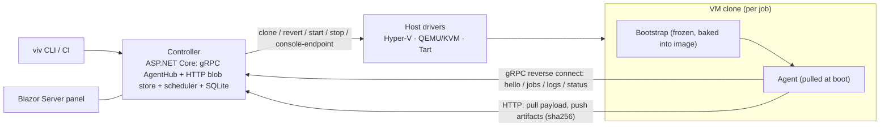

# Vivarium Architecture

> This document holds the *shape* of the system; [`AGENTS.md`](../AGENTS.md) holds the *rules* for working on it.
> Status: **design phase** — everything here is a decision record, not a description of running code.
> When a decision changes, this file changes in the same commit.

## 1. Problem and goals

Vivarium runs test corpora against many operating-system configurations: Windows 10/11 at an exact
patch level, Windows with specific third-party software preinstalled, Ubuntu, macOS. Every run starts
from a pristine, versioned machine state, and results land in one *test × scenario* matrix.

Goals, in priority order:

1. **Reproducible machine state.** A scenario is a versioned image; a job always starts from its sealed snapshot.
2. **Central control.** One controller with a web panel: queue, fleet, image registry, results. Monitoring a farm by hand does not scale past two VMs.
3. **Payload-agnostic jobs.** NUnit/.NET is the default test vehicle, but the runner contract must fit anything — Rust test binaries, plain scripts, one-off commands.
4. **Cheap scenario authoring.** Adding "Win10 19044 + product X v1.2" is a small recipe diff plus one build command, not an afternoon of clicking.

Non-goals:

- Not a CI server. CI (TeamCity, GitHub Actions, anything) calls Vivarium via CLI/API and consumes the matrix.
- Not container-based. Real OS installs are the point: patch levels, drivers, services, interactive desktop sessions, macOS.
- Not a general VM manager. Only the operations the test loop needs.

## 2. Core model

The mental model is TeamCity's, with one deliberate inversion: TeamCity agents are *pets*
(long-lived, cherished), Vivarium agents are *cattle* — a clone lives for exactly one job.
The first-class entity TeamCity does not have is the **versioned image**.

| TeamCity | Vivarium |
|---|---|
| Build Configuration | **Suite** — payload definition + scenario matrix |
| Build | **Run** — suite × set of image versions, expands into Jobs |
| Build Queue | Job queue with leases and heartbeats |
| Agent | Ephemeral VM clone (cattle) |
| Agent Pool / requirements | Host pools + scenario selectors (os, build, installed software) |
| Artifacts / Build Log | Content-addressed blob store / streamed job log |
| Unauthorized agent | *Unadopted* machine → adopt flow (§8.4) |
| — | **Image registry**: images, versions, snapshots, lineage — the core addition |

## 3. Components

One controller process, thin drivers, deliberately dumb guests.



- **Controller** (`Vivarium.Controller`): job queue, image registry, scheduler, host drivers, agent rendezvous (gRPC), blob store, result store (SQLite), Blazor Server web panel. One Kestrel host serves all of it.
- **Host driver** (per hypervisor): `Clone(imageVersion) → VmInstance`, `Revert`, `Start`, `Stop`, `TakeSnapshot`, `GetConsoleEndpoint`, plus MAC assignment on clone. Nothing else — no guest file copy, no guest exec (see D1). In-process .NET implementations first; if third-party drivers ever appear, garm's external-executable provider contract is the sanctioned escape hatch.
- **Bootstrap** (`Vivarium.Bootstrap`): the only thing baked into images. Frozen contract (§7).
- **Agent** (`Vivarium.Agent`): pulled by bootstrap at boot; executes jobs, streams logs, uploads results. Deliberately dumb — all decisions live in the controller.
- **CLI** (`Vivarium.Cli`, binary `viv`): submit runs, ad-hoc exec, status, adopt — a client of the same gRPC API as the panel. This is also the CI integration point.
- **Contracts** (`Vivarium.Contracts`): the `.proto` files and generated types shared by all of the above.

## 4. Key decisions

Numbered so later docs and commits can reference them.

### D1. Agents reverse-connect; drivers stay minimal

The controller never reaches *into* a guest (no SSH, WinRM, PowerShell Direct, guest-ops APIs — every
hypervisor has a different zoo of these). Instead the guest agent dials out to a well-known controller
address after boot: hello → receive job → pull payload → stream logs → push results. This is the model
every CI agent uses, and it collapses the per-hypervisor driver surface to clone/revert/start/stop —
which is exactly why adding QEMU or Tart later is cheap. No IP discovery, no firewall pain, no guest credentials.

### D2. Only a frozen bootstrap is baked into images

Baking the agent into snapshots means every agent bugfix rebuilds every snapshot — the #1 operational
pain of VM farms. Images carry only a tiny **bootstrap** with a frozen contract (§7); the real agent is
downloaded from the controller at boot (manifest + sha256), so agent updates are "publish a file".
The controller can tell a running agent to restart (`RestartAgent`), and bootstrap picks up the new version.

### D3. The job contract is files-in / process / files-out

The runner does not know what NUnit is. A job is: payload blobs (sha256-addressed) → unpack → run one
command with env/cwd/timeout → collect declared globs → exit code. *Result adapters* on the controller
side parse well-known formats into the result model:

- **Default payload — NUnit on .NET**, published **self-contained** per RID, executed as a plain exe
  producing TRX (Microsoft.Testing.Platform route; NUnitLite is the classic fallback). No SDK or runtime
  is ever installed in guests — a "pristine customer machine" stays pristine.
- **Rust** plugs into the same pipe: `cargo nextest archive` + the static nextest binary shipped inside
  the payload, JUnit XML out.
- Tests that drive an arbitrary SUT treat it as just another payload artifact; the agent passes
  `VIVARIUM_SUT_PATH`, `VIVARIUM_SCENARIO`, `VIVARIUM_RESULTS_DIR` env vars.

### D4. gRPC control plane, plain-HTTP data plane

One bidirectional gRPC stream per agent (`Session`) carries hello, job assignment, status, log chunks,
heartbeats. Bulk data — payloads and artifacts — moves over plain HTTP on the same Kestrel host
(`GET/PUT /blobs/{sha256}`): resumable, idempotent, deduplicated by construction, debuggable with curl,
and free of gRPC message-size ceilings.

Two consequences of memory-restore drive transport details:

- **Guest clocks wake up in the past**, which breaks TLS certificate validation — including the agent's
  own connection. MVP: h2c (gRPC over cleartext HTTP/2) inside an isolated host-only network, plus a
  bearer token. Later option: pinned self-signed cert with a validation callback that ignores dates.
  Additionally, the controller sends its wall-clock with every hello response and job assignment, and
  the elevated agent corrects guest skew immediately — Cuckoo has shipped exactly this `clock`
  parameter for fifteen years.
- **The agent's TCP connection is dead after restore but doesn't know it.** gRPC keepalive pings
  (~10 s interval / 5 s timeout) on both sides detect it in seconds; the agent treats any disconnect
  as "reconnect and re-hello"; the controller treats a lost lease as an INFRA failure (D9).

### D5. Revert point = snapshot with memory; linked clones for parallelism

The runtime snapshot of an image version is taken on a *booted, logged-in, idle* system with bootstrap
waiting. Revert-with-memory brings a live agent back in ~2–5 s instead of a 30–90 s cold Windows boot.
Cold boot remains a per-scenario option (boot-time behavior is itself worth testing). Parallel jobs use
linked clones / differencing disks (AVHDX, qcow2 backing, APFS COW for Tart) so N clones of a 40 GB
image are instant and near-free; a 32 GB host comfortably runs ~5–6 Windows VMs at 2 vCPU / 4 GB.

### D6. Provisioning is a job with a different epilogue

A job's epilogue is one of: **revert** (test jobs), **keep** (ad-hoc/debug), or **seal** (provisioning):
reboot → autologon → wait for a clean hello → take the memory snapshot → register a new `ImageVersion`.
One machinery for everything; there is no separate "image builder" tool. Recipes are declarative files
in git (§8.2), including honest `manual` steps for software that cannot be installed silently.

### D7. Clone ↔ agent correlation is MAC-based

With three parallel clones of the same image, "which VM just said hello?" must be answerable. The driver
assigns each clone a known MAC; the agent reports its MAC (plus a per-boot `boot_id` GUID) in `Hello`.
No per-boot config injection into guests is needed, which keeps memory snapshots valid.

### D8. The VM lifecycle is an explicit state machine

`CLONING → BOOTING → READY → BUSY → COLLECTING → REVERTING | DESTROYING`, plus `SEALING`
(provisioning) and `QUARANTINE` (keep-on-fail). Every transition is timestamped and has a timeout;
"stuck in BOOTING for 120 s" is an INFRA alert and an automatic recycle. This state machine is
simultaneously the scheduler skeleton, the main panel view, and the alerting source — it is what makes
"monitoring the farm" tractable. Following LAVA, *health* (good / bad / maintenance / retired — set by
canaries and operators) is a separate axis from *state*: a canary failure marks an image version or
host bad and removes it from scheduling without touching in-flight jobs.

### D9. Failure taxonomy: INFRA / TEST / CRASH

- `INFRA` — no hello, lost heartbeat, revert failure, timeout before the payload ever ran. Retried
  silently on another clone; never shown as a test failure.
- `TEST` — the payload ran and reported failures (TRX/JUnit). Never auto-retried.
- `CRASH` — nonzero exit without a result file; dumps collected.

Mixing infra noise into test results is the fastest way to make the matrix untrustworthy; the taxonomy
is enforced in the data model, not by convention. Prior art converges here: GitLab's custom-executor
contract separates `BUILD_FAILURE` from `SYSTEM_FAILURE` exit codes and auto-retries only the latter;
syzkaller classifies merged console+process output into crash / lost-connection / no-output with typed,
bounded-retry infra errors.

### D10. Guests run an interactive desktop by default

Input synthesis, overlays, foreground windows, and installers need a real unlocked session. Images are
built with: autologon, agent launched as a logon task of that user, **elevated** (UAC off or
highest-available — a non-elevated agent can neither fix the clock nor send input to elevated windows
past UIPI), screen lock/screensaver disabled, fixed resolution. Session type is reported in `Hello`;
jobs can require `interactive`.

### D11. Drift detection

The agent reports the *actual* OS build in `Hello`. If an image claims 19044 and the guest reports
19045, Windows Update leaked through — the panel flags the image version red instead of silently
poisoning the matrix. Images are built with updates/telemetry disabled and Defender exclusions for the
work directory (unless "AV enabled" *is* the scenario — then it is a scenario axis, §8.2).

### D12. Debugging affordances are first-class

- **WER LocalDumps** (Windows) / `core_pattern` (Linux) preconfigured in images — crash dumps of the SUT collect themselves.
- **Screenshot on failure** taken by the agent.
- **keep-on-fail**: the clone moves to `QUARANTINE` instead of being reverted; connect via console.
- **snapshot-the-corpse**: optionally snapshot the VM *at the moment of failure* — the failed state
  becomes revertable-to forever. Nearly free with this machinery; almost nobody offers it.
- **Console access**: the driver exposes a console endpoint (Hyper-V `.rdp` / vmconnect, VNC for
  QEMU/Tart). An embedded web console is a later nicety.

### D13. Fleet maintenance is scheduled work, not heroics

Linked-clone chains grow; blobs accumulate; images rot. The controller schedules: periodic re-baseline
(fresh clone from base), disk compaction, blob GC, snapshot-chain pruning, and **health-check canary
jobs** — a trivial boot-hello-run job per image version on a cadence, so a rotten image is caught by a
canary, not by a real run at 2 a.m. Host disk/CPU/RAM are shown on the panel with alerts.

## 5. Protocol sketch

```proto
syntax = "proto3";
package vivarium.v1;

service AgentHub {
  rpc Session (stream AgentMsg) returns (stream ControllerMsg);
}

message AgentMsg {
  oneof msg {
    Hello hello = 1;
    JobStatus status = 2;     // FETCHING / RUNNING / COLLECTING
    LogChunk log = 3;         // stdout/stderr, chunked, bounded buffering
    JobResult result = 4;     // exit code + sha256 list of uploaded artifacts
    Heartbeat heartbeat = 5;
  }
}

message ControllerMsg {
  oneof msg {
    JobAssignment job = 1;
    CancelJob cancel = 2;
    RestartAgent restart = 3; // exit; bootstrap fetches the current agent version
  }
}

message Hello {
  string image_id = 1;        // from bootstrap.json
  string boot_id = 2;         // GUID per boot
  string mac = 3;             // clone correlation (D7)
  string agent_version = 4;
  OsInfo os = 5;              // ACTUAL os/build — drift detection (D11)
  bool interactive = 6;       // live desktop present
}

message JobAssignment {
  string job_id = 1;
  repeated Blob payload = 2;      // {url, sha256, unpack_to}
  RunSpec run = 3;                // cmd/args/env/cwd/timeout/session
  repeated string collect = 4;    // result globs
  OnFail on_fail = 5;             // NONE / KEEP_VM / SNAPSHOT_VM
}
```

Blob endpoints: `GET/PUT /blobs/{sha256}`. Bootstrap endpoints: `GET /bootstrap/manifest?os=&arch=`,
`GET /setup.ps1`, `GET /setup.sh` (§8.4).

Job flow: scheduler picks (scenario × suite) → driver clones/reverts + starts → hello → assignment →
payload pull (sha-verified) → exec (log stream + heartbeats) → artifact push → result → adapter parses
TRX/JUnit → epilogue (revert/seal/keep per D6).

## 6. Data model

`Host` (driver, capabilities, cpu/ram/disk) → `Image` (recipe ref, lineage) → `ImageVersion`
(snapshot ref, recipe hash, parent version, declared+actual OS build, sealed-at) → `VmInstance`
(clone: state per D8, current job, MAC). Plus `Suite`, `Run`, `Job` (with failure class per D9),
`Blob`, `TestResult` (normalized from TRX/JUnit: case, outcome, duration, artifacts).

Results are tagged with the exact `ImageVersion`, so updating an image never silently changes what a
historical run means, and the matrix can show "started failing at product-X 1.2 → 1.3".

Storage: SQLite + blob directory. No external services.

## 7. Bootstrap contract (frozen)

The only code inside images; it must never need to change. Entirety of its behavior:

1. Read `bootstrap.json` next to itself: `{ controllerUrl, imageId, secret }`.
2. Loop: `GET /bootstrap/manifest?os=…&arch=…` → `{version, sha256, url}`; if the local agent differs,
   download, verify sha256, swap atomically (temp + rename); launch the agent with the config;
   wait for exit; repeat with jittered backoff.

Self-contained single-file .NET; size is irrelevant inside a 40 GB image. Rebuilding images is required
only when the scenario's software set changes (legitimate) or bootstrap itself changes (should not happen).

## 8. Images

### 8.1 Layers

1. **Base images** — OS at an exact patch level + bootstrap + autologon + updates/telemetry off +
   Defender exclusions + WER dumps + fixed resolution. Built manually at first; unattended
   (autounattend.xml / autoinstall) later. Exact-build Windows media comes from UUP dump (operator-run;
   `rgl/uup-dump-get-windows-iso` is the automation model), and `autounattend.xml` can be generated
   from recipe fields with the embeddable MIT `cschneegans/unattend-generator` library.
2. **Scenario versions** — base + provisioning recipe, sealed (D6) into an `ImageVersion` with a
   memory-state runtime snapshot.

### 8.2 Recipes

```yaml
# images/win10-19044-avx.yaml
parent: win10-19044-clean@v3
steps:
  - run: avx-setup-1.2.exe /S
    payload: avx-setup-1.2.exe
  - run: powershell -File tune.ps1
  - manual: "Installer X has no silent mode - click through it in the console, then press Done"
verify: { os_build: 19044 }
network: nat        # nat | offline | full — a first-class scenario axis
```

`manual` pauses the pipeline, points the operator at the VM console, and resumes on confirmation —
manual work is legalized and versioned instead of happening outside the system.

Steps will grow into a typed catalog (Azure DevTest Labs' artifact manifests — title, target OS, typed
parameters, run command — rendered as forms in the panel) and support reboot-and-resume semantics for
multi-reboot installs (Boxstarter's trick). Network profiles are enforced at the host level — deny-all
with an allowlist for the job's duration, as Ludus' testing mode does — which also stops Windows Update
drift *during* long jobs, not only between rebuilds.

### 8.3 Runtime snapshot definition

Sealed at: booted → autologon completed → bootstrap idle in its pre-connect wait → memory snapshot.
After every revert, bootstrap's pending connection naturally dies (D4) and it reconnects fresh.
A sealed `ImageVersion` is immutable — clones derive only from sealed versions and never mutate them
(Proxmox's linked-clones-only-from-templates invariant).

### 8.4 Adopting hand-made machines

Install the OS by hand, run one line inside the guest:

```
iwr http://ctrl:8080/setup.ps1 | iex          # Windows
curl -fsSL http://ctrl:8080/setup.sh | sh     # Linux / macOS
```

The script installs bootstrap + autologon task + `bootstrap.json` and starts it. The machine appears on
the panel as **unadopted**; *Adopt* snapshots it and registers `Image v1`. This is also the complete
answer to "how do I get the agent onto a machine" — after this one-liner, agent delivery is automatic forever.

## 9. Ad-hoc execution

Both are ordinary `JobAssignment`s:

- `viv exec --image win10-19044-avx -- powershell -c "..."` — clone, run, stream output, revert.
  "Check this quickly on a clean 19044" as a one-liner.
- `viv exec --vm <id> -- ...` — same on a *live* machine (unadopted / quarantined / mid-provisioning),
  no revert. Line-based streaming first; a real interactive terminal (ConPTY + stdin channel over the
  same gRPC session) is a later feature — until then, the console button covers interactivity.

## 10. Platforms

| Guests | Host | Hypervisor | Memory snapshots |
|---|---|---|---|
| Windows, Linux | Windows host | Hyper-V (first driver) | yes (standard checkpoints) |
| Windows, Linux | Linux host | QEMU/KVM (second) | yes (savevm) |
| macOS | Apple hardware only (EULA) | Tart on a Mac mini | no — instant APFS clones + ~20 s boot instead |

The controller sees hosts as pools with capabilities; a Mac mini is just another node running the same
agent contract. Tart is driven as an external CLI, so its Fair Source license (free below 100 CPU
cores, possibly moving to permissive OSS) never links into Vivarium; Orchard — Cirrus' own Tart
orchestrator — is the reference for that driver.

## 11. Web panel

Blazor Server in the controller process (SignalR gives live updates for free; no JS toolchain).
Views: **Fleet** (hosts + VM state machine, the D8 conveyor), **Images** (registry: lineage, versions,
drift badges, snapshot chains, build/promote/rollback/prune), **Runs/Queue** (TeamCity-shaped),
**Matrix** (test × scenario, the product of the whole system), **VM console** links.

## 12. Prior art

Surveyed separately in [`docs/prior-art.md`](prior-art.md) — openQA, Cuckoo/CAPE, LAVA, syzkaller,
GitLab custom executors, Anka/Orchard/Tart, Packer-based image pipelines, ephemeral-runner managers,
and what Vivarium borrows from each.
