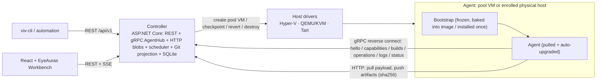

# Vivarium Architecture

> This document holds the *shape* of the system; [`AGENTS.md`](../AGENTS.md) holds the *rules* for working on it.
> Status: **Phase 1 implementation** — decisions describe the target shape; the roadmap records which
> slices are running. When a decision changes, this file changes in the same commit.

## 1. Problem and goals

Vivarium is one controller and one cross-platform agent serving two product planes (D22):
**TeamCity mode** runs build/test workflows across heterogeneous agents, while **AgentExplorer mode**
observes and manages the physical-agent fleet independently of builds. Image-backed scenarios may
start from pristine versioned VM state; enrolled physical machines remain first-class.

Goals, in priority order:

1. **Reproducible machine state.** An image-backed scenario is a versioned, sealed snapshot; a
   pristine build always starts from it. Physical scenarios trade reproducibility for realness —
   deliberately (D16).
2. **Central control.** One controller with REST and a web panel: projects, builds, queue, hosts,
   operations, image registry, and results. Monitoring a farm by hand does not scale.
3. **Payload-agnostic builds.** NUnit/.NET is the default test vehicle, but the runner contract must fit anything — Rust test binaries, plain scripts, one-off commands.
4. **Cheap scenario authoring.** Adding "Win10 19044 + product X v1.2" is a small recipe diff plus one build command, not an afternoon of clicking.

Non-goals:

- Not a hosted SCM, code-review, or general CD suite. Vivarium's TeamCity mode is the execution farm:
  external CI may call it, but it can also build, test, and report on its own configurations.
- Not container-based. Real OS installs are the point: patch levels, drivers, services, interactive desktop sessions, macOS.
- Not a general infrastructure manager. AgentExplorer manages only enrolled agents and the explicitly
  advertised, policy-enabled host capabilities.

## 2. Core model

Vivarium's TeamCity plane adopts TeamCity's model **wholesale — entities, statuses, and semantics** —
and gives it an automation-first spin: builds run bulk test corpora across machine *conditions*, and
the machine side grows providers, a pristine lifecycle, and an image registry. TeamCity even contains the seed of our
split already: regular agents (installed once, authorized, auto-upgraded) vs cloud profiles (agents
spawned from images on demand, auto-authorized, discarded after idle). Vivarium generalizes the second
into machine providers (D15) and adds what TeamCity never had: versioned images with sealed snapshots
and revert-to-pristine before a build.

| TeamCity | Vivarium |
|---|---|
| Project / Build Configuration / Build | Same, verbatim (D14) |
| Build Queue; agent requirements vs agent parameters | Same, verbatim |
| Agent status: connected × authorized × enabled × idle/building | Same, verbatim (D8) |
| Agent auto-upgrade from the server | Same — launcher handshake (D2) |
| Regular agents | **Enrolled agents**: physical boxes, long-lived VMs (D16) |
| Cloud profiles / cloud agents | **Machine providers**: hypervisor (clones of ImageVersions), cloud, static pool (D15) |
| Service messages `##teamcity[…]` | Same, verbatim (D14) |
| Artifacts / build log | Content-addressed blob store / streamed log |
| Investigations & muted tests | Planned: matrix triage — mute a test × scenario cell |
| — | **Image registry + pristine clean policy**: sealed versioned snapshots, recipes, drift detection |

The same agent also serves AgentExplorer host inventory and capability-bounded operations without creating
Projects or Builds (D22). Agents may be pets *or* cattle: an enrolled physical machine is a classic TeamCity agent; a
provider-spawned clone lives for exactly one build. **Pristine is a capability and a clean policy
(D5), not the only lifecycle** — a build configuration that just wants a real connected machine runs
on one, as is.

## 3. Components

One controller process, thin drivers, deliberately dumb guests.



- **Controller** (`Vivarium.Controller`): Git reconciliation, REST management, build queue, AgentExplorer
  operations, image registry, scheduler, machine providers, agent rendezvous (gRPC), blob store, and
  operational/result store (SQLite). One Kestrel host serves the API and built React assets.
- **Machine providers** (D15): supply Agents to the queue — a static pool of enrolled Agents (physical boxes, hand-managed VMs), hypervisor providers that maintain pools of pristine VMs per `ImageVersion` (host drivers live here), and later cloud providers for short-living instances.
- **Host driver** (per hypervisor): `CreatePoolVm(imageVersion)`, `Start`, `Stop`, `TakeCheckpoint`, `RestoreCheckpoint`, `Destroy`, `GetConsoleEndpoint`. Nothing else — no guest file copy, no guest exec (see D1). In-process .NET implementations first; if third-party drivers ever appear, garm's external-executable provider contract is the sanctioned escape hatch.
- **Bootstrap** (`Vivarium.Bootstrap`): the only thing baked into images. Frozen contract (§7).
- **Agent** (`Vivarium.Agent`): pulled by bootstrap at boot; advertises typed capabilities and facts,
  executes TeamCity builds and separately fenced AgentExplorer requests, streams logs, and uploads results.
  Policy and scheduling decisions live in the controller.
- **CLI** (`Vivarium.Cli`, binary `viv-cli`): a client of the public REST API for projects, builds,
  AgentExplorer, administration, and status. The implemented gRPC `ControlPlane` remains a transitional
  adapter until REST parity (D24).
- **Contracts** (`Vivarium.Contracts`): the `.proto` files and generated types shared by all of the above.

## 4. Key decisions

Numbered so later docs and commits can reference them.

### D1. Agents reverse-connect; drivers stay minimal

The controller never reaches *into* a guest (no SSH, WinRM, PowerShell Direct, guest-ops APIs — every
hypervisor has a different zoo of these). Instead the guest agent dials out to a well-known controller
address after boot: hello → receive build → pull payload → stream logs → push results. This is the model
every CI agent uses, and it collapses the per-hypervisor driver surface to the small §3 verb set —
which is exactly why adding QEMU or Tart later is cheap. No IP discovery, no firewall pain, no guest
credentials. Physical machines make this non-negotiable: there is no hypervisor to reach through at all.

### D2. Only a frozen bootstrap is baked into images

Baking the agent into snapshots means every agent bugfix rebuilds every snapshot — the #1 operational
pain of VM farms. Images carry only a tiny **bootstrap** with a frozen contract (§7); the real agent is
downloaded from the controller at boot (manifest + sha256). Agent and Server are two components of one
Vivarium release: publishing a Server release also publishes its exact per-RID Agent bytes. The
controller can tell a running agent to restart (`RestartAgent`), and bootstrap picks up the Agent
component of the running Server release.

The handshake is TeamCity-shaped but operation-driven: an administrator selects an Agent or rollout
scope, never a package. The controller resolves the immutable package matching its own release and the
Agent RID, drains the Agent, and only then orders a restart under D30. On physical machines this is
the *only* update path — install once by hand, upgrade centrally
forever — which is why bootstrap must stay boring. Pool checkpoints may carry yesterday's agent; the
post-revert upgrade costs one small LAN download **and an agent process restart, not a reboot** —
pool VMs never reboot between builds (D5). Periodic maintenance re-checkpoints pool VMs with the
current agent (D13); no image rebuild involved.

### D3. The build contract is files-in / process / files-out

The runner does not know what NUnit is. A build is: a payload **archive** (sha256-addressed; file
modes and symlinks preserved — loose per-file blobs lose the executable bit the moment a Linux agent
unpacks them) → unpack with path-traversal hardening (the agent runs elevated; a hostile archive must
not write outside the workdir) → run steps (commands with env/cwd/timeout, D14) → collect declared
globs → exit codes. *Result adapters* on the controller
side parse well-known formats into the result model:

Phase 1 makes the archive itself reproducible: paths are ordinally ordered and normalized, timestamps
are fixed, Unix modes and symlink targets are explicit, and the sha256 therefore depends only on the
payload plus the declared set of Unix-target step programs. On Windows, where source mode bits do not
exist, only existing payload-local programs selected by Linux/macOS (or RID-less) cells are promoted
to `0755`; unrelated files remain `0644`, and cells sharing a payload root contribute a deterministic
union. Unix source modes remain authoritative. Creation refuses a linked payload root or path
components that escape it. Extraction rejects
rooted paths, traversal, duplicate or type-conflicting entries, platform path aliases, symlink pivots,
and links whose resolved target leaves the workdir before writing anything outside the destination.
The durable terminal result owns its ordered artifact manifest; the matrix and build-results page
project that manifest and provide build-scoped downloads without copying child artifacts into the
composite build. Format adapters such as TRX remain a separate controller-side projection over those
immutable raw artifacts. The first bounded TRX projection now persists adapter/schema provenance,
report state, stable/fallback test definitions, and occurrences while retaining the raw artifact as
the authority; REST/UI presentation and broader adapter support remain separate work.

- **Default payload — NUnit on .NET**, published **self-contained** per RID, executed as a plain exe
  producing TRX (Microsoft.Testing.Platform route; NUnitLite is the classic fallback). No SDK or runtime
  is ever installed in guests — a "pristine customer machine" stays pristine.
- **Rust** plugs into the same pipe: `cargo nextest archive` + the static nextest binary shipped inside
  the payload, JUnit XML out.
- Tests that drive an arbitrary SUT treat it as just another payload artifact. Phase 1 exports
  `VIVARIUM_BUILD_ID`, `VIVARIUM_WORKDIR`, `VIVARIUM_RESULTS_DIR`, optional `VIVARIUM_CELL`, and
  normalized `VIVARIUM_PARAM_*` values; a test locates its SUT inside the workdir or receives its path
  as an ordinary resolved argument/parameter.

**Payload portability doctrine** — "no runtimes in guests" cuts both ways; payloads must be built for
pristine machines: Rust/MSVC binaries with `crt-static` (or they silently die on a machine without the
VC++ redist), self-contained .NET with `InvariantGlobalization` or bundled ICU for minimal Linux, a
documented glibc floor, cross-published macOS binaries verified to carry at least ad-hoc signatures
(Phase 0 smoke-verified: a Linux-published arm64 binary runs on macOS — the SDK ad-hoc signs
cross-platform), and `cargo nextest` archives shipped **with the source tree** and run with
`--workspace-remap` — nextest requires the workspace layout on the target; a static nextest binary
alone is not enough. TRX output requires the `Microsoft.Testing.Extensions.TrxReport` package in the
test project.

### D4. Reverse-gRPC agent plane, authenticated HTTP data plane

One bidirectional gRPC stream per agent (`Session`) carries hello, capability negotiation, build and
AgentExplorer work, status, log chunks, and heartbeats. Bulk data — payloads and artifacts — moves over plain HTTP on the same Kestrel
host (`GET/PUT /blobs/{sha256}`): idempotent and retryable, deduplicated by construction, debuggable
with curl, and free of gRPC message-size ceilings. Implemented blob endpoints carry the same bearer
tokens as gRPC; planned bootstrap/setup endpoints must also be authenticated, with initial trust as
specified by D21. The Phase-1 **agent**, **submit**, and **admin** tokens are a coarse implementation
baseline; the target user/service-account permission model and first-run claim are D26. A CI secret
must not be able to perform AgentExplorer remote execution on a dev box. And the blob store defends
itself: the server verifies that a `PUT /blobs/{sha256}`
body actually hashes to its name — a content-addressed cache an agent can poison is worse than none.

Agent credentials prove identity; the independent *authorized* flag controls scheduling (D8).
Unauthorizing a known Agent therefore does not invalidate its credential halfway through an in-flight
artifact upload. Deleting the Agent is the credential-revocation operation.

Two consequences of memory-restore drive transport details:

- **Guest clocks wake up in the past**, which breaks ordinary TLS validation — including the agent's
  own connection. The answer is **pinned TLS from day one, not cleartext**: the controller generates a
  self-signed certificate at first run; its fingerprint travels in the enroll one-liner and in
  `bootstrap.json`; agents validate by pinned fingerprint with a callback that ignores validity dates.
  This authenticates the server to elevated agents on a routable LAN (physical machines, D16, made the
  old "isolated host-only network" premise obsolete) *and* survives warped clocks. Additionally, the
  controller returns its wall-clock in `Welcome` (§5). The Phase 1 agent measures and exposes the skew;
  applying a privileged OS clock correction remains part of the machine setup/provider work. Cuckoo
  has shipped exactly this `clock` parameter for fifteen years.
- **The agent's TCP connection is dead after restore but doesn't know it.** gRPC keepalive pings
  (~10 s interval / 5 s timeout on the agent transport, plus application heartbeats enforced by the
  controller) detect it in seconds; the agent treats any disconnect
  as "reconnect and re-hello". A re-hello carries the build the agent still believes it is running, so
  the controller **re-adopts or aborts** the ghost instead of double-scheduling next to it; every
  retry is fenced on the agent's `session_id` — a nonce regenerated at every (re)connect, because a
  pool VM resumes the *same OS boot* across reverts (D5) and a per-boot id would never change — and
  assignment delivery is acknowledged by the exact accepting session and remains a durable queue
  claim until then. The agent treats a duplicate assignment for the same build as an idempotent resend,
  never a second execution. Terminal results are persisted on the agent and retried until the controller
  acknowledges the first durable result. A stream or controller that dies on either side of these
  handshakes therefore cannot make a build execute twice or lose its result. A lease lost past its
  timeout is an INFRA failure (D9).

Application heartbeats make the connection fact observable even when a transport stalls. The
controller expires a silent session after a bounded lease, cancels that stream, and lets the agent
reconnect; it retains build ownership during the reconnect window so disconnection alone cannot
double-schedule work. A newer `session_id` supersedes the previous stream atomically.

### D5. Pristine is a clean policy; its revert point is a memory snapshot

Per build configuration (or machine), the **clean policy** is one of: `pristine` (revert to the
machine's pristine checkpoint before the build — requires checkpoint capability), `reboot` (the honest reset physical
machines can offer), `clean-workdir`, or `none` (run on the connected machine as-is — plain TeamCity
behavior). Configurations state what they need through ordinary agent requirements; checkpoints are
first-class, not mandatory. The rest of this decision describes how `pristine` works on managed VMs.

`pristine` is implemented with **pool VMs**, not clones-of-a-snapshot. A hypervisor cannot cheaply
clone a *memory* checkpoint: Hyper-V import copies the multi-GB runtime state per copy, a NIC's MAC
cannot change while a VM holds saved state, and a restored memory image still carries the donor's MAC
inside the guest network stack — the naive "seal once, clone N ways" design bricks networking on day
one. So the unit is a pool: for each `ImageVersion` the provider pre-creates N persistent VMs —
differencing disks off the sealed parent VHDX/qcow2 are the genuinely instant, near-free part — and
each pool VM boots once *as itself* (own MAC, own hostname), reaches the logged-in idle state, and
takes **its own** memory checkpoint. Revert = restore-own-checkpoint: honestly ~2–5 s to a live agent
instead of a 30–90 s cold Windows boot — the Phase 0 spike measured ~1 s per cycle and 4.7 s for five
concurrent reverts on an NVMe dev host with OS-less guests
([spike results](spikes/hyperv-checkpoints.md)); 2–5 s stays the planning number for real guests. Pool capacity is the parallelism knob and grows in the
background (one first-boot per added VM). Cold boot remains a per-scenario option — boot-time behavior
is itself worth testing. Sizing reality: a 32 GB host runs ~5–6 Windows pool VMs at 2 vCPU / 4 GB —
fewer when the host doubles as somebody's dev machine.

Hyper-V specifics the model depends on — pinned in the driver, because they are not the defaults:
**Standard** checkpoints (the modern default is Production: VSS, no memory state, applies to *off* —
which silently degrades "2–5 s" into a cold boot), automatic checkpoints disabled, **static memory**
(dynamic memory can fail a restore under host pressure, and memory size is scenario identity anyway),
static MAC. A revert resumes the *same OS boot* — pool VMs never reboot between builds, so per-boot
identifiers cannot fence anything (D4) and the guest wakes with stale DHCP/ARP/TCP state: the agent's
post-restore ritual is clock fix (D4), then network refresh (DHCP renew / ARP flush), then reconnect.
QEMU's `savevm` writes guest RAM into the qcow2 — expect tens of seconds per revert, not Hyper-V-class
latency. Tart has no checkpoints at all and runs the clone-per-build lifecycle instead (D15, §10).

The provider/controller hand-off is explicit: before restoring a checkpoint, record the agent's
monotonic connection generation; after restore, do not mark the machine `READY` until that same agent
has connected with a *newer* generation, reports no running build in `Hello`, and is idle. A stale TCP
stream or the first re-hello of a ghost build can therefore never race a new assignment. The provider
owns restore/start/stop; the agent registry owns this readiness barrier.

### D6. Provisioning is a build with a different epilogue

A build's epilogue is one of: **revert** (pristine builds), **none** (persistent machines — plain
TeamCity behavior), **keep** (debug quarantine), or **seal** (provisioning). Sealing is **disk-only**
(§8.3): the provision VM's checkpoints are deleted (an online merge), it shuts down cleanly, and its
disk chain is merged into a **standalone parent VHDX** registered as the new `ImageVersion` — flat
parents beat diff-on-diff version chains, whose read amplification grows with every generation. A
provision build runs on a fresh dedicated VM created from the parent version and consumed by the seal —
never on a serving pool VM. Sealed parents are immutable forever: Hyper-V invalidates every child of a
touched parent, so "patch the parent" is always "new ImageVersion + rebuild pools" (§8.3).

The epilogue is part of the Build's leased lifecycle, not best-effort work after terminal publication.
After the raw agent result and output seals commit, the Build enters `RELEASING`; its final outcome and
machine capacity are published only after revert/none/keep/seal completes or fails (D14/D22/D27).

Provisioning steps may legitimately reboot the machine (installers do). Such steps are marked
`expected-reboot`, which suppresses D9's lost-heartbeat INFRA classification and re-adopts the build
on the agent's next hello (D4) instead of retry-storming half-provisioned VMs.

**Phase 1 limitation:** submissions containing `expected-reboot` are rejected. Safe resume needs a
durable execution cursor and an explicit bounded reboot window; treating the flag as an unlimited
reconnect lease would permanently consume an agent after a failed installer. That journal and resume
protocol land with provisioning in Phase 3.

One machinery for everything; there is no separate "image builder" tool. Recipes are declarative files
in git (§8.2), including honest `manual` steps for software that cannot be installed silently.

### D7. Agent identity: pool VMs and enrolled machines

Provider-managed pool VMs (D5) have stable identity by construction — each is a persistent VM the
controller created, with its own MAC and hostname known up front, so "which VM just said hello?"
answers itself; the agent still reports its MAC and a per-connect `session_id` nonce in `Hello` as a
cross-check and for fencing (D4). Pool agents are **auto-authorized** — but authorization must rest on
more than self-reported claims: the provider verifies the connection against **host-side facts** (the
hypervisor knows each pool VM's MAC and switch port without any guest channel — reading them breaks no
D1 rule) and a per-VM nonce injected at `CreatePoolVm` time (Hyper-V KVP, QEMU fw_cfg) and echoed in
`Hello`. An `image_id` anyone can type is not an identity.

Enrolled agents — physical machines, long-lived VMs — carry a persistent identity instead: a GUID
generated at install plus an authorization token issued when the operator authorizes them, delivered
over the live session in an explicit `AuthorizationGranted` message (§5) — `Welcome` only reports the
current status at connect time. One name everywhere: the token is `auth_token` in `Hello` and in
`AuthorizationGranted`. The agent stores its identity and token in its own data directory, never in
`bootstrap.json` (§7). The controller stores credential generations/hashes and runtime registration
state in protected SQLite/private storage, while the desired Agent declaration and policy are
Git-backed (D23/D26); an enrollment token is short-lived, stored hashed, and claimed by one agent. A
pending agent may reuse that proof only to complete authorization delivery after a dropped session.

### D8. Agent status is TeamCity's; provider lifecycle is Vivarium's

Two separate layers, deliberately.

**Agent status — TeamCity 1:1.** Four independent axes: *connected/disconnected* (a network fact),
*authorized/unauthorized* (effective desired authorization + credential state per D26 — unauthorized
agents connect and are visible but never receive new work), *enabled/disabled* (Git desired policy),
and TeamCity *idle/building*. Agent occupancy is separately `none | build | agent-explorer-operation |
upgrade | provider-maintenance` under D22, so a non-Build operation cannot masquerade as Building.
Compatibility is computed per build configuration from requirements vs agent parameters, exactly as
TeamCity does. These statuses are mandatory, first-screen information. Disabling an agent prevents
new assignments but deliberately does not stop its current build; stopping is a separate build
operation. Authorization and enablement survive disconnects and controller restarts. Durable agent
name, custom properties, enablement/maintenance, and desired authorization flow through Git (D23);
immediate drain/suspend, credential issuance/revocation, and deletion are audited security/operational
actions (D26). Deleting a busy Agent is rejected or held behind a quiescence barrier until its
work is stopped and fenced.

The transitional Phase 1 implementation persists the small fact set reported in `Hello` separately from operator-owned custom
parameters. The Agents panel edits the custom map, key collisions are rejected, and both maps merge
deterministically for compatibility matching. Direct panel mutation is replaced by the D23 Git/REST
path; either path is fenced against assignment, and the selected
name plus both parameter maps are copied into immutable build history. An audit/API surface for custom
parameter changes remains work. Platform inventory must still grow to Windows build + UBR, Linux
distro facts from `/etc/os-release` (with kernel separate), and macOS product version; the current raw
`Environment.OSVersion.Version` is not an exact patch-level inventory contract.

**ProviderInstance lifecycle — provider-managed Agents only.** Pool VMs additionally walk an explicit conveyor:
`CREATING → FIRST_BOOT → CHECKPOINTING → READY → BUSY → COLLECTING → REVERTING → READY … → DESTROYING`,
plus `SEALING` (provisioning) and `QUARANTINE` (keep-on-fail); clone-per-build providers (D15) walk
the degenerate form `CREATING → FIRST_BOOT → BUSY → DESTROYING`. Every transition is timestamped and
has a timeout; "stuck in FIRST_BOOT for 120 s" is an INFRA alert and an automatic recycle. Physical
Agents have no conveyor — their recycle is a reboot, or an operator. `on_fail: keep` on a physical
Agent preserves the workdir and flags the build for inspection but does not quarantine the box — a
capacity-1 Agent cannot be held hostage by one red build; the operator's *disable* toggle exists for
deliberate quarantine.

Following LAVA, *health* (good / bad / maintenance / retired — set by canaries and operators) is a
third, orthogonal axis: a canary failure marks an image version, machine, or host bad and removes it
from scheduling without touching in-flight builds. Together these three layers are the scheduler
skeleton, the main panel view, and the alerting source — what makes "monitoring the farm" tractable.

### D9. Failure taxonomy: INFRA / TEST / CRASH

- `INFRA` — no hello, lost heartbeat, revert/cleanup failure, or timeout before the payload ever ran.
  A post-test epilogue failure retains the raw test evidence but makes the final Build infrastructure-
  failed because the machine was not safely released. Retried
  silently — on another clone, or after a reboot on a physical machine; never shown as a test failure.
- `TEST` — the payload ran and reported failures (TRX/JUnit). Never auto-retried.
- `CRASH` — nonzero exit without a result file; dumps collected.

Mixing infra noise into test results is the fastest way to make the matrix untrustworthy; the taxonomy
is enforced in the data model, not by convention. Prior art converges here: GitLab's custom-executor
contract separates `BUILD_FAILURE` from `SYSTEM_FAILURE` exit codes and auto-retries only the latter;
syzkaller classifies merged console+process output into crash / lost-connection / no-output with typed,
bounded-retry infra errors.

Phase 1 currently persists distinct `INFRASTRUCTURE_FAILED` and `CANCELLED` terminal outcomes and uses
`INFRASTRUCTURE_FAILED` for queue and reconnect expiry. A nonzero process exit is still the generic
`FAILED` outcome. The bounded TRX adapter now creates durable test definitions/occurrences and explicit
projection states without changing raw evidence, but it does not yet normalize the Build outcome to
`TEST`. JUnit, no-result normalization into `CRASH`, dump collection, and bounded automatic INFRA retry
remain; until those land the complete taxonomy above is a target classifier contract.

### D10. Guests run an interactive desktop by default

Input synthesis, overlays, foreground windows, and installers need a real unlocked session. Images are
built with: autologon, agent launched as a logon task of that user, **elevated** (UAC off or
highest-available — a non-elevated agent can neither fix the clock nor send input to elevated windows
past UIPI), screen lock/screensaver disabled, fixed resolution. Session type is reported in `Hello`; build configurations
can require `interactive`. Enrolled physical machines intended for UI tests follow the same checklist
by hand — the agent reports the truth either way.

Platform realities that live here rather than in anyone's imagination: **macOS TCC** — Accessibility /
Input Monitoring / Screen Recording grants cannot be scripted by any one-liner; they are manual
System-Settings work, done once per enrolled Mac and once per macOS image before sealing. **Console
access to UI state**: connecting to a Hyper-V VM in enhanced session mode opens an RDP-style
*separate* session — inspecting a quarantined UI failure through it can destroy the very session state
you came to see; use basic mode for inspection, and run `manual` provisioning steps (§8.2) in basic
mode too, or they get sealed into an RDP session. **Headless physical boxes** render no real desktop —
UI/overlay behavior diverges without a display, so a dummy plug or virtual display adapter is part of
the machine checklist. **Linux**: input synthesis is straightforward on X11 and restricted under
Wayland — UI-test images prefer an X11 session until a Wayland story exists.

### D11. Drift detection

The agent reports the *actual* OS build in `Hello`. If an image claims 19044 and the guest reports
19045, Windows Update leaked through — the panel flags the image version red instead of silently
poisoning the matrix. Images are built with updates/telemetry disabled and Defender exclusions for the
work directory (unless "AV enabled" *is* the scenario — then it is a scenario axis, §8.2).

### D12. Debugging affordances are first-class

- **WER LocalDumps** (Windows) / `core_pattern` (Linux) preconfigured in images — crash dumps of the SUT collect themselves.
- **Screenshot on failure** taken by the agent.
- **keep-on-fail**: the pool VM moves to `QUARANTINE` instead of being reverted (its pool backfills); connect via console.
- **snapshot-the-corpse**: optionally snapshot the VM *at the moment of failure* — the failed state
  becomes revertable-to later. Nearly free with this machinery; almost nobody offers it. Corpses pin
  their VM's disk chain, so they carry a retention budget (count + age), not an eternal freeze.
- **Console access**: the driver exposes a console endpoint (Hyper-V `.rdp` / vmconnect, VNC for
  QEMU/Tart). An embedded web console is a later nicety.

### D13. Fleet maintenance is scheduled work, not heroics

Checkpoint chains and pool diff disks grow; blobs accumulate; images rot. The controller schedules:
periodic pool re-baseline (rebuild pool VMs from the sealed parent), disk compaction, blob GC,
checkpoint pruning, and **health-check canary
builds** — a trivial boot-hello-run build per image version on a cadence, so a rotten image is caught
by a canary, not by a real run at 2 a.m. Host disk/CPU/RAM are shown on the panel with alerts. Blob GC is
reference-counted with a grace window (an in-flight `PUT` or a just-submitted build must not race
collection), and retention is explicit: blobs referenced by retained builds are never collected —
"a historical cell never silently changes meaning" (§6) is a retention policy, not a hope.

### D14. The work model is TeamCity's, names included

`Project` → `Build Configuration` (steps, requirements, parameters, artifact rules) → `Build`
(queued → running → finished), scheduled from a `Build Queue` onto compatible agents. A scenario
matrix expands into a **matrix build** whose cells are ordinary builds, aggregated composite-style.
Projects and Build Configurations have globally unique immutable IDs and mutable display names; names
are never historical keys. Each Build stores the immutable configuration revision it instantiated.
Steps have execution policies (default / even-if-failed / always) so diagnostics collection runs even
after a failing test step. A cell whose requirement matches no known agent **fails fast at submit**
("no compatible agents") instead of queueing forever, and queue-wait has its own timeout, separate
from the run `timeout:`. Earlier drafts of this document said Suite/Run/Job; the adopted names are
build configuration / matrix build / build.

Matrix submission is atomic: if any selected cell is statically impossible against known agent/image
capabilities, the request is rejected and no sibling is queued. A matrix parent is a Build with its own
ID; its declared cell key is `(configuration revision, scenario ID, iteration)`, and each execution has
an ordinary child Build ID. Actual agent/machine/image provenance is added when scheduled, not folded
into the declared cell key. Aggregate outcome precedence is `INFRASTRUCTURE_FAILED` over `FAILED` over
`CANCELLED` over `SUCCEEDED`, while the result projection preserves all child categories. “Rerun this
historical build” uses its saved definition and source revisions; “run configuration” creates a new
Build from the current applied revisions.

The Phase 1 executor distinguishes `default` from the two continuation policies after an ordinary
step failure, but cancellation currently aborts the executor before an `always` diagnostic step can
run. Making `always` distinct from `even-if-failed` on cancellation remains part of the cancellation
slice.

The Build Queue is a durable global FIFO. As in TeamCity, a queued build is not assigned to an agent
until it can actually start. The scheduler scans for the first *runnable* entry so an incompatible
head does not block unrelated capacity, and dispatch requires all independent agent axes to permit it:
connected, reconciled after `Hello`, authorized, enabled, idle, and compatible. Static compatibility
is kept separate from current eligibility, so an otherwise matching disabled or disconnected agent
means “waiting for capacity”, not the submit-time “no compatible agents” failure.

Compatibility is never authorization. Before selection, the caller/Project/Build Configuration must
be permitted to use the candidate pool/trust class under the applied RBAC and Git policy revision; that
revision and the provider/machine capability snapshot join immutable Build provenance.

Like TeamCity's maximum waiting time, each queued cell has a persisted absolute queue deadline (the
controller default is 30 minutes, overridable per build configuration). A claim and the final
queued-to-running transition both require the deadline to be strictly in the future. At the boundary,
expiry wins atomically, removes the queue entry, and finishes the cell as `INFRA` with `queue wait
timeout expired`; it is not user cancellation and never reaches an agent. Legacy rows are assigned
`enqueued time + current default` once, so a controller restart or configuration change cannot extend
an existing wait.

Stopping is controller-owned and idempotent: a running build moves to `cancel-requested`, the
controller sends `CancelBuild(build_id, reason)` and resends it after reconnect until a terminal result
arrives. The agent cancels the active step, kills its whole process tree, and returns the terminal
outcome `CANCELLED` with the reason. Build ownership, the assignment, cancellation intent, and the
first terminal result are persisted before they become controller facts: after a controller restart,
active rows are restored, agent occupancy is re-adopted on `Hello`, and a pending cancellation is
resent. Stopping a matrix parent is one serialized SQLite transaction: every still-queued child and
its queue claim become terminal `CANCELLED`, every running child becomes `cancel-requested`, terminal
children remain unchanged, and the first cancellation reason wins. Only after commit does the
controller project that intent into live agent sessions, so a crash between persistence and delivery
is restart-safe. Disabling an agent is never an alias for stopping a build.

As in TeamCity, results belong to the ordinary child build. A matrix parent aggregates child states
and outcomes but does not flatten their artifacts. The protected build-results page shows every cell's
durable outcome, step results, and artifact manifest, and its download endpoint verifies matrix/cell
ownership before serving content-addressed bytes. Test occurrences join later through the D3 adapters;
they are not inferred from exit codes or artifact filenames.

The queued-to-running transition also copies the selected agent's name, reported-parameter map, and
operator-owned custom-parameter map into the child build as separate fields. That provenance is
immutable execution history: a later `Hello`, custom-parameter edit, rename, or Agent deletion
cannot rewrite what the result page and `WatchBuild` say the cell ran on.

Target execution has a `RELEASING` phase after the agent result is durably accepted. The Build keeps
its Agent lease while final output watermarks are acknowledged and the provider/clean-policy
epilogue completes. Only then is its final outcome published and capacity released. Cleanup/revert
failure produces final `INFRASTRUCTURE_FAILED` while retaining the raw test/step evidence that preceded
it; a VM is never reused merely because the test process already returned.

Live progress uses **TeamCity's service-message protocol verbatim**: the agent scans step stdout for
`##teamcity[testStarted …]` / `testFailed` / `progressMessage` / … and forwards them as structured
events. Every reporter that already speaks TeamCity — NUnit's TeamCity listener, pytest-teamcity,
Gradle, dozens more — becomes a live Vivarium progress source with zero integration work. Authoritative
results remain the collected TRX/JUnit files (D3); service messages only stream the build as it runs.

Two adapter realities: (1) per-test history needs **stable test identity** across scenarios —
parameterized NUnit test names can vary by culture and OS (a `tr-TR` locale axis will rename tests
unless identity is normalized adapter-side); (2) service messages arrive on payload-controlled
stdout — forgeable, interleaved, split across chunks — so the parser treats them as progress hints
only, never as results, and handles escaping and partial lines defensively.

### D15. Agents come from providers

The scheduler asks `MachineProvider`s for capacity; a provider implements
`Acquire(requirements) → agent` / `Release(agent)` and may manage an attached `ProviderInstance`:

- **Static pool** — enrolled Agents (physical boxes, hand-managed VMs). Capacity is what it is.
- **Hypervisor provider** (Hyper-V / QEMU / Tart) — maintains a pool of pristine VMs per sealed
  `ImageVersion` (D5): reverts a pool VM before each build, grows or drains pools as the queue
  demands, within host caps. TeamCity's cloud-profile logic verbatim, with checkpoints added; pool
  agents are auto-authorized against host-side identity (D7). Providers declare a **lifecycle mode**:
  *revert-pool* (Hyper-V, QEMU) or *clone-per-build* (Tart — no checkpoints today; `tart suspend` on
  macOS 14+ may enable pools later; cloud providers are clone-per-build by nature). Same seam, two
  honest lifecycles.
- **Cloud provider** (Azure first; later) — short-living instances from cloud images; the agent is
  baked into the image or installed by an init script and reverse-connects like everyone else. Not in
  the first release, but the seam exists from day one — GitLab's fleeting and garm validated exactly
  this scaler-vs-provider split (see prior-art).

Provider/image lifecycle details and ownership live in
[`design/machine-providers-images.md`](design/machine-providers-images.md); Scheduling owns the shared
lease/order, Platform owns native OS adapters, and Agent API/SDK owns the guest protocol.

### D16. Physical Agents are first-class

A physical box is enrolled with the same one-liner, authorized like any TeamCity agent, and described
by its parameters — it *is* a scenario, with capacity 1 and no pristine capability. Its clean policies
are `reboot` / `clean-workdir` / `none`; INFRA failures mark it bad and notify instead of recycling —
there is nothing to recycle. Later options for pristine-on-metal: PXE re-imaging or disk-restore
tooling, plus WoL/IPMI power management. Builds on physical cells record the agent's full parameter
snapshot in place of an `ImageVersion` (§6).

### D17. Repository build configurations are code

`vivarium.yaml` lives next to the code it tests; `viv-cli run` submits it together with payload blobs
(sha256-deduped upload). Automation-first means a repository-owned run definition versions with the
product, GitHub-Actions-style, rather than living in hidden server-side state. The controller may also
catalog Projects and Build Configurations and the UI may author them, but every such edit is a Git
change through D23; it never mutates an authoritative SQLite row. Named matrix cells select
agents via requirement expressions (`system.os.family == windows`) or, from Phase 2, images
(`image: win10-19044-clean`); template variables (`{rid}`, `{os}`, `{arch}`, `{exe}`, `{results}`)
specialize payload paths and steps per cell so one definition covers every OS — with one rule: `{rid}`
used in `payload:` must resolve at upload time, so cells shipping RID-specific payloads declare `rid:`
explicitly instead of hoping the matched agent implies it. `viv-cli run` waits by default and exits
nonzero on any red cell — CI integration is an exit code, not a plugin (`--no-wait` opts out).
[`walkthrough.md`](walkthrough.md) is the normative UX for all of this.

### D18. Scenarios are environment × parameters × repetition

The matrix is not an OS list. A **scenario** — the named unit that becomes a matrix column and a rerun
target — is a machine selector (`agent:` expression or `image:`) *plus* a parameter bag *plus* an
optional repeat count. Two definition styles normalize to the same thing: cross-product axes
(`matrix:` with `exclude:`/`include:` pruning, GitHub-Actions-style — the machine axis is just one
axis among value axes) and an explicit named `scenarios:` list for hand-picked combos. Parameters
reach the build as `{param.*}` template variables and `VIVARIUM_PARAM_*` environment variables;
selecting a test subset per scenario is just an argument (`--filter {param.suite}`), not machinery.
Each cell build records its scenario name, resolved parameters, and iteration index alongside "what it
ran on" (§6).

`repeat: N` is first-class (flake hunting, stress): every iteration is an ordinary build; the matrix
cell aggregates them into a pass rate (47/50), and `viv-cli run --repeat N` overrides ad hoc. Repeats on
pristine cells are truly independent runs — that combination is the honest flakiness detector. Several
scenarios matching the same persistent agent serialize on its queue (TeamCity semantics); image-backed
scenarios fan out across the image's pool instead. Guardrails are part of the design: per-configuration
concurrency caps and queue priorities keep a `repeat: 50` cell from starving every other scenario on
the only matching box.

The boundary with in-test parameterization stays sharp: values only the test process cares about
belong in NUnit `[TestCase]`; Vivarium parameterizes what the process cannot — the environment, the
invocation, the machine. Naming follows from the matrix itself: *rows* are already test cases (the
payload framework's, with per-test history across scenarios), so the columns are *scenarios*, not cases.

Declared cell identity uses the stable scenario ID and iteration under one configuration revision, not
the eventual machine. When an expression cell resolves to a different machine/image, immutable
provenance and history grouping expose or partition that environment change so pass rates do not
silently blend — the matrix badges it (§6).

### D19. Everything ships portable; the controller is the distribution point

All four shipped binaries — `viv-server`, `viv-agent`, `viv-agent-update`, and `viv-cli` — target
self-contained single-file .NET publishes per RID: no installers or registry state, and admin rights
are needed only for elevated/autologon *duties* (D10), never just to run. Controller, bootstrap, and
agent state live in their explicitly selected data/install directories; `viv-cli login` is the
intentional exception and stores per-user client trust and credentials under the platform
application-data directory. The TeamCity Compile → Release → Publish chain now produces deterministic
per-RID archives; code signing is deferred and recorded (§13).

The release version is one code identity shared by every RID and component. The repository owns
`major.minor` through `VivariumVersionBase`; TeamCity Compile uses its build counter as the numeric
patch and cross-publishes every supported RID as `major.minor.build`. Release consumes those exact
Compile artifacts without rebuilding, and Publish creates or verifies `v<version>` at the chain's
source commit before publishing the GitHub Release. A tag is publication output, not version input.
The CLR Assembly/File versions remain the stable `major.minor.0.0` compatibility identity because
their numeric fields are 16-bit; protocol negotiation, runtime status, package catalogs, CLI output,
and releases use the unbounded SemVer product/informational version.

The release runtime depends only on itself: every Server archive embeds both the unstamped public
Agent template and a D30 child-only Agent package for every supported RID. The schema-v1
`agent-packages/catalog.json` binds those immutable child packages to the exact Server version and is
imported on startup; `/bootstrap/manifest` serves only the operation-selected package. The panel's
future Downloads page and enroll scripts use the separate public template, so an air-gapped farm never
phones GitHub. The catalog contains exactly one Agent package for every supported RID, and every entry's
version equals the Server version; an incomplete or mismatched catalog fails Server startup.
Old package rows remain only as immutable operation history and rollback evidence. They cannot be
selected for a new upgrade. Agent development therefore produces and starts a new Server release bundle,
then rolls that release's Agent component to a canary; arbitrary side-loading is not a production
management contract.

Agent downloads are **preconfigured, TeamCity-style**: the panel's Downloads page stamps the zip at
request time with a ready `bootstrap.json` — controller URL, certificate fingerprint, enroll token —
so on the target machine the whole ceremony is *unzip → run → the agent appears unauthorized → click
Authorize*. No flags, no config editing; works from a USB stick and in air-gapped labs. (The
GitHub-Releases agent zips are the unstamped templates this is built from — the controller is the
place to download agents.) A stamped enroll token gets a lenient TTL: it only gates appearing in the
unauthorized list, while authorization remains the real gate — exactly TeamCity's model. For
automation and hand-rolled setups the scriptable form still exists (`viv-agent enroll --url …
--fp … --token …` — an *agent* verb; bootstrap stays the frozen dumb loop, §7), and running the agent
interactively in a console is a first-class mode for debugging.

### D20. Four test tiers; the hypervisor is faked until it can't be

(1) **Logic tests** — NUnit on Microsoft.Testing.Platform, the same stack payloads use: scheduler and
compatibility matching, matrix expansion, adapters against golden files, blob GC, fencing — with
**virtual time**, so lease and queue timeouts never sleep. (2) **In-process protocol tests** — a real
Kestrel controller on a loopback port plus real agent child processes: Session/Welcome, enrollment,
authorization, upgrade handshake, reconnect-and-re-adopt, result idempotency. Phase 0's "session loop
alive" is this suite's first member, not throwaway code. (3) **FakeMachineProvider** — simulated pool
VMs backed by local agent processes (revert = process restart + workdir reset) drive the full D8
conveyor deterministically with zero hypervisors. (4) **Real-hypervisor E2E** — QEMU/KVM and Hyper-V
smoke on explicitly provisioned TeamCity agents once those drivers exist; the development hosts come
first, then the farm runs the same scheduled/manual configurations itself.

Two structural consequences become release gates once the first release and managed farm exist:
protocol backward-compatibility will be enforced by CI running the tier-2 suite against the
**previous release's agent binaries** (the HLK lock-step lesson), and Vivarium will dogfood through the
repo's own `vivarium.yaml`, with canary builds gating agent rollouts. Neither gate can run before there
is a previous release and the installer/upgrade path. Details and CI mapping:
[`DEVELOPMENT.md`](DEVELOPMENT.md).

### D21. Installer bytes are authenticated before execution

Enrollment begins outside Vivarium's trust boundary, so a downloaded setup script cannot establish
its own authenticity after it has started. Initial installer/package bytes must be authenticated
*before execution*: the generated command uses a server SPKI pin already obtained through a trusted
channel when the stock downloader supports it, or the operator verifies an independently obtained
package digest before running the package. The single-use enroll token authenticates the setup fetch
as well as the subsequent enrollment flow; it is not a substitute for authenticating the server. A
`curl -k ... | sh` command followed by an in-script fingerprint check is explicitly rejected because
an attacker can replace the script and omit that check. The exact cross-platform commands and token
lifetime must be proven in the installer slice before §8.4 is declared complete.

### D22. One agent serves TeamCity and AgentExplorer, but their work models stay separate

One physical host normally runs one Vivarium Agent. A stable `agent_id` identifies that Agent across
AgentExplorer, TeamCity scheduling, side-effect leases, and immutable execution history. Credential
generation, process instance, `session_id`, and connection generation are replaceable runtime aspects
of the Agent, not separate fleet resources. V1 accepts one current session per Agent and atomically
supersedes an older session on reconnect. The same reverse-connected session advertises versioned
feature capabilities for two independent controller domains:

- **TeamCity** owns `Project → Build Configuration → Build → Step Run`, requirements, queue-visible
  policy, artifacts, and results. Scheduling owns matching algorithms, leases, and fencing.
- **AgentExplorer** owns searchable Agents, host facts, environment/process/network observations, and
  later file, command, process, software, and desired-state operations.

A capability is not a fact, label, policy, or permission. The agent advertises supported capability
IDs and versions even when its current service account lacks permission. Agent-reported facts describe
observed host state; operator properties and enablement come from Git (D23); RBAC decides what the
caller may request (D26). Effective availability has separate support, applied-policy, caller-
authorization, runtime-eligibility, and request-outcome/completeness axes. Provider-owned VM
capabilities such as clone, snapshot/revert, power, and console belong to a `ProviderInstance` and its
`MachineProvider`, not to the guest agent.

The canonical requirement/fact namespaces are `system.*` (observed host facts), `env.*` (explicitly
published safe environment parameters), `capability.*`, `custom.*`, `agent.*`, and `provider.*`.
The current `os.*` keys are transitional aliases to migrate before the public REST/Git contract freezes.
Policy-sensitive agent behavior is dispatched only after the agent acknowledges a validated policy
bundle by applied Git revision and content digest.

AgentExplorer operations are not Builds and do not require a Project. Read-only observations may coexist
with a Build when bounded and policy permits; a mutating AgentExplorer operation, agent upgrade, provider
rollback, and Build execution coordinate through the same durable per-Agent lease and fencing model.
Rollback, Build, and cleanup/epilogue stay inside one lease so no remote operation can mutate the actual
host between restore and execution. Detailed contracts: [`design/agent-api-sdk.md`](design/agent-api-sdk.md),
[`design/agent-explorer.md`](design/agent-explorer.md), and
[`design/scheduling-coordination.md`](design/scheduling-coordination.md).

Inventory probes carry `agent_id`, agent-session generation, and observation epoch. Provider lifecycle
stops new probes and waits for or invalidates current probes before rollback; a response from an older
epoch is stale evidence and cannot update the current Agent projection. Legacy agents may finish only
the Build protocol they negotiated; they never receive AgentExplorer mutations or general work leases,
and provider-managed agents upgrade before readiness.

### D23. Git is the source of truth for mutable desired configuration

Every durable setting or property becomes effective from a validated Git revision: Projects and Build
Configurations, fleet/pool policy, agent names/custom properties/enablement policy, RBAC assignments,
retention and non-secret server settings, provider/image recipes, and other desired state. Repository-
owned `vivarium.yaml` remains with the product (D17); controller-owned desired state lives in a control
repository initialized or adopted during first-run administration (D26).

The first-release control repository is managed-local Git with direct commits on its authoritative
branch, so an air-gapped first run is deterministic. A Project may explicitly bind a product/settings
repository and path; that repository owns its Build Configuration definitions and source revision,
while the control repository owns Project identity/metadata, repository bindings, fleet/RBAC/server
policy, and allowed paths. Every Build records the resulting revision set. Remote Git authority and
review branches are opt-in and require private credential references plus verified HTTPS CA/SPKI or SSH
host-key trust. Security-sensitive external commits are accepted only under attested identity or an
explicit policy treating writers to that protected authoritative branch as administrators for the
resources it owns.

REST, UI, CLI, and external Git edits converge through one validation and reconciliation pipeline.
The controller commits or proposes an atomic candidate tree, validates the committed bytes, and only
then advances the applied revision. A rejected or unavailable revision leaves the last-known-good
projection active and visible as stale/degraded; it never triggers a fallback mutation in SQLite.
Concurrent edits carry an expected base revision. Rollback is a forward-moving revert commit, never
history rewriting.

SQLite remains authoritative for runtime facts and durable execution state and may cache materialized
Git projections. Credentials, secret values, enrollment/session/heartbeat state, observations, builds,
operations, results, audit events, and high-volume logs stay outside Git. Git stores stable secret
references only. Runtime actions are authorized and audited (D27), not manufactured into meaningless
configuration commits. Detailed contract: [`design/git-versioning.md`](design/git-versioning.md).

### D24. REST is the canonical public management API from the first public-management slice

Before exposing that slice, the controller establishes the shared management kernel beneath the
existing surfaces: versioned storage migrations, D27's minimal durable audit journal, request actor
and correlation context, and D26's common authorization evaluator. This foundation is transport-
independent and does not create a competing management API.

`/api/v1` is the public management contract for both TeamCity and AgentExplorer. The React panel, `viv-cli`
CLI, automation, and external integrations call the same application services through REST; no client
gets an in-process or direct-database mutation path. Resource representations expose stable IDs,
separate configuration/observation/runtime revisions, optimistic concurrency, cursor pagination,
structured errors, principal-scoped idempotency for
retryable creates/actions, and durable asynchronous `Operation` resources with explicit cancellation.
OpenAPI is generated and treated as a compatibility surface; SSE provides resumable live projections
where polling is insufficient, while durable reads remain authoritative.

This decision does not replace the reverse AgentHub gRPC stream or the authenticated HTTP blob data
plane. The implemented gRPC `ControlPlane` is a transitional compatibility adapter over the same
application services and gains no management feature absent from REST; the CLI migrates before that
adapter is retired. Detailed contract: [`design/rest-api.md`](design/rest-api.md).

Configuration writes use `If-Match` against the authoritative repository revision; heartbeats and live
observations never create false configuration conflicts. Secret-producing requests persist only a
non-secret receipt/hash and never replay plaintext, and every replay rechecks current authorization and
object visibility. Build submission dedupe is scoped by principal plus client request ID. REST blob-
upload plans replace `MissingBlobs` without revealing cross-project presence, and object grants bind
staging, assignment GET, owned-work PUT, result manifests, and human downloads to their Project/Build.

### D25. The web panel is React on the vendored EyeAuras Workbench

The Phase-1 Blazor panel is transitional. The target panel is a TypeScript/React application built on
EyeAuras UI Workbench and served as static assets by the controller's Kestrel host. Vivarium vendors a
reviewed built package set with its exact source commit, license, notice, and reproducible sync metadata;
the initial runtime set is Workbench core, React adapter, and React Router adapter. Tauri integration is
not shipped, and the Monaco editor adapter waits until a file/editor workflow needs it (the Workbench
core's required `monaco-editor` peer remains).

The browser uses REST for reads/mutations and SSE for live projections. Configuration forms show the
base/applied Git revision and reviewable diff and submit through the D23 mutation path. Information
architecture begins with TeamCity-shaped Projects/Builds/Queue/Results and AgentExplorer Agents/Agent Details;
Files and Commands may appear as clearly disabled planned surfaces before their agent capabilities ship.
The Workbench shell has a compact top application bar, a narrow activity rail that switches TeamCity,
AgentExplorer, and Administration, one adjacent resizable/expandable/auto-hide context pane for the
selected workspace, and one canonical routed page.
AgentExplorer's Agents collection is a dedicated page; selecting a name navigates to a separate stable
Agent page whose Summary, Build History, Compatible Configurations, Environment, Processes, Network,
Metrics, Logs, and Parameters are Agent-local tabs/deep links rather than global pane entries. Entity
routes use immutable IDs rather than mutable names. Main pages follow
modern TeamCity's compact breadcrumbs, object headers, actions, tabs, and operational tables rather than
decorative dashboard cards.
Every UI change routes through UI Expert. Detailed contract: [`design/ui.md`](design/ui.md).

### D26. Authorization follows TeamCity roles; first run is a one-time local claim

Vivarium starts with TeamCity's recognizable built-in roles and additive inheritance: **System
Administrator**, **Project Administrator**, **Project Developer**, **Project Viewer**, and **Agent
Manager**. Project permissions follow the project tree; fleet permissions follow a separate fleet/pool
tree so project access never implies sensitive AgentExplorer inventory, remote command, process control,
file write, software mutation, secret-value, or global agent-management permission. Absence of a grant
is denial; the first model has no explicit deny entries. Service accounts and personal tokens are
attenuated identities under the same evaluator, and authorization is enforced below REST/UI/CLI
adapters.

Built-in role IDs and their minimum permission bundles are product schema/code; Git stores bindings,
custom roles, and permitted additive customization, so a hostile or old commit cannot strip the
security floor. Effective agent authorization is `applied desired authorization ∧ valid current
credential generation ∧ no suspend overlay`. Durable enabled/maintenance policy is Git-backed;
immediate drain/suspend is a persisted, audited operational overlay with precedence, reason, actor, and
explicit release/expiry semantics. Ordinary unauthorize stops new work but preserves a fenced completion
lane for an already running Build; deletion waits for quiescence and then atomically revokes/tombstones
credentials. Git rollback never resurrects revoked credentials.

An unclaimed controller generates a bounded single-use bootstrap token and emits it exactly once to a
local protected startup channel (or an explicitly mounted secret file for noninteractive/container
deployment). The token opens only the setup API. Exchange creates a durable resumable setup operation,
so browser loss, restart, session expiry, or an explicitly configured remote review cannot strand the
controller. The operation creates the first durable administrator, initializes/adopts the managed-local
Git control repository and its baseline, assigns System Administrator, consumes the token, and moves the
controller to active state. Host-local status/rotate/reissue/abandon/recover controls are explicit and
audited; late results from an abandoned proposal cannot reactivate it. Normal restarts never
regenerate a standing super-user credential. Explicit host-local recovery may mint a short-lived,
single-use **Superuser** session, but it still cannot bypass Git activation, leases, audit, or secret
redaction. Detailed contracts: [`design/authorization-model.md`](design/authorization-model.md) and
[`design/first-run-administration.md`](design/first-run-administration.md).

### D27. Actions are auditable; logs are structured, redacted, and bounded

Audit events, controller/agent diagnostics, TeamCity build output, and AgentExplorer operation output are
separate streams with explicit retention and access policy. Every state-changing request and denied
mutation records actor/service identity, correlation and idempotency IDs, target, action, outcome,
controller receipt time, and the applied Git revision when configuration-derived. Build and remote
operation output is chunked, sequence-aware, backpressured, and size-bounded; metrics represent repeated
healthy state instead of log spam.

The audit journal begins as a minimal append-only SQLite `audit_events` table, not an ordinary rolling
log. When caller-visible success depends on accepted intent, the audit row commits in the same serialized
transaction. Automatic heartbeat, queue, scheduler, and conveyor transitions remain domain state,
metrics, build annotations, or selective diagnostics rather than flooding the security audit stream.

Bearer values, cookies, passwords, environment secrets, Git credentials, request bodies, and raw remote
commands are not ordinary log fields. The only plaintext bootstrap-token exception is the single local
first-run delivery required by D26; it is never repeated through REST/UI or forwarded diagnostic logs.
Audit and terminal execution history are crash-safe; retention/GC never silently changes the meaning of
a retained Build. A terminal agent result carries immutable final sequence watermarks for every output
stream. Result and output acknowledgements may be independent, but Agent release/reuse or provider
revert waits until every range is durably stored or an explicit durable gap is recorded. Detailed contract:
[`design/logging.md`](design/logging.md).

### D28. Agent is the public fleet identity; provider instances are lifecycle details

Vivarium has one stable fleet/execution resource: `Agent`, identified by controller-owned `agent_id`.
The public REST collection is `/api/v1/agents`; AgentExplorer, enrollment/authorization, scheduling,
leases, operations, Git policy, audit, and execution provenance all refer to that same identity. The
controller does not expose a parallel host fleet collection or reinterpret an Agent session as a
second registration resource. Display name, hostname, credentials, process lifetime, and `session_id` may
change without changing `agent_id`.

Fresh enrollment creates an Agent. Re-enrollment or reinstall may reclaim an existing `agent_id` only
through controller-issued proof and an audited credential-generation replacement; a client-selected ID,
hostname, or MAC address is never sufficient proof. Reconnect replaces only the current session and
increments its connection generation. Historical records keep the `agent_id` plus the exact session,
credential generation, and connection generation that executed work where those details matter.

A provider may separately track a `ProviderInstance`: the native VM or host allocation used for power,
clone, snapshot, restore, console, and destroy operations. A ProviderInstance may exist before its guest
connects, but it must attach to the intended `agent_id` through provider-authenticated evidence before
the Agent becomes ready. Physical and hand-managed Agents normally have no ProviderInstance. Public
provider resources use `providerInstanceId`; provider implementation terminology does not create a
second fleet identity or change Agent-facing REST paths.

### D29. Managed-local configuration uses a narrow system-Git adapter first

The first managed-local D23 implementation invokes a compatible system `git` executable through a
narrow controller adapter; it does not add a managed Git library/native package to the controller.
Candidate changes use an isolated index and Git object plumbing, validate the complete candidate tree,
and advance `refs/heads/main` with `update-ref <new> <expected>` compare-and-swap. The authoritative
repository remains a normal non-bare human-usable checkout. A private expected/result synchronization
marker makes a ref-update/checkout crash recoverable; automatic checkout repair is permitted only when
the index and worktree exactly match the recorded expected or result tree. Human dirty state blocks
writes and is never reset or overwritten.

Git is a local runtime tool, not an external service or configuration authority. The adapter passes
arguments without a shell, supplies bounded secret-free commit identity/metadata, does not put
credentials in command arguments, and treats a missing/incompatible executable as an explicit
configuration-repository failure. Remote Git, credentials, and host trust remain gated. Packaging must
either bundle a proven compatible Git or declare and verify the prerequisite on every supported
controller platform before an end-user release; the adapter boundary permits a future managed
implementation without changing D23's revision/mutation contract.

### D30. Agent updates are authenticated, operation-driven, and health-gated

A controller release bundles its immutable Agent packages, but starting that controller never silently
restarts the whole fleet. An administrator starts a central canary or rolling rollout; no interactive
access to an Agent host is required. A new operation always targets the package owned by the running
Server release for the Agent's observed RID; neither REST, UI, nor CLI accepts an arbitrary package ID.
Package identity is `(version, RID, SHA-256, size)`, the digest is authoritative, bytes are
content-addressed outside Git, and importing the same identity is idempotent while conflicting bytes
are rejected. A missing current-release package fails the operation closed without draining the Agent.

Initial enrollment starts a seed package whose bytes were authenticated before execution under D21.
Before authorization, bootstrap never requests a manifest. After authorization, bootstrap and Agent
share one protected data directory and native principal, so bootstrap reuses the existing Agent bearer
credential for same-origin manifest/package GETs over pinned TLS. The server derives `agent_id` from
that credential, authorizes only the package targeted by that Agent's current upgrade operation, and
never puts a credential in a URL or a package manifest. A second local package secret is forbidden
until a real OS-principal isolation boundary justifies its lifecycle.
Agent identity, bearer, and credential-generation files use durable replace semantics; an initialized
installation with missing, empty, or malformed identity evidence fails closed. Enrollment proof is not
consumed until a fresh Hello proves the durably stored bearer.

An upgrade is a durable runtime operation, not a Git configuration mutation. Creating it atomically
persists the exact target package and an Agent maintenance drain before new Build admission. Existing
work finishes. Only after the controller has proved that no Build owns the Agent does it durably enter
`HANDOFF_READY`; this is the update commit point and the earliest state in which bootstrap may read an
activation manifest. Before that point cancellation is terminal and may release the drain. At or after
that point cancellation becomes `ROLLBACK_REQUESTED`; it never makes an ambiguous process schedulable.

Bootstrap is a singleton supervisor of exactly one identified child. It independently polls the
authenticated handoff channel while the child runs, so a lost `RestartAgent` notification does not
require host access. It never activates a package in `DRAINING`, never launches the last-known-good
child until candidate death is positively observed, and preserves an operation identity across its own
restart. Verified content is staged in a content-addressed directory before a durable atomic active-
state change; activation is permitted only when the manifest's exact prior digest still equals the
local active slot, and the second post-download manifest must be byte-for-byte equivalent in all
directive fields. An expired operation never returns `activate`. The previous authenticated slot
remains last-known-good. Initial installers stamp a digest for the seed executable so the first
rollback has exact evidence too. An Agent must advertise the negotiated
`vivarium.bootstrap-supervisor.v1` capability from a live launcher lease before an upgrade operation
can be created.

Success requires the same stable `agent_id`, current credential generation, a newer accepted
connection generation, operation ID, exact target digest/RID, compatible protocol, completed controller
reconciliation, no ghost Build, and a bounded probation. Health is a crash-recoverable handshake:
controller acceptance lets the Agent durably publish candidate readiness; bootstrap durably records
promotion and acknowledges it locally; the Agent confirms that launcher receipt; the controller
records commit-pending and asks the Agent for a durable commit marker; only the matching final
confirmation commits `SUCCEEDED` and releases the drain. Every message is exact-session and safely
repeatable. Deadline, early exit, explicit rollback, or cancellation after the commit point kills the
candidate, activates the retained prior slot once, and holds the drain until that exact slot reconciles.
A repeatedly bad or unkillable candidate remains `FAILED`/quarantined and visibly drained. Failure to
terminate is durably queued by bootstrap and retried before any manifest processing or child launch;
the matching Hello is independent failure evidence, and the controller acknowledgment is idempotent.

Controller restart resumes the operation from SQLite and may repeat manifest reads, package reads, or
health messages. Restart dispatch is persisted before send, bounded, and at most once per connection
generation unless its durable retry deadline passes; it cannot create an unbounded outbox or audit
storm. Each session outbox is bounded; overflow fences the stalled session and lets normal reconnect
recovery run without affecting peers. At most one nonterminal or quarantined maintenance operation owns an Agent drain, and another
Agent remains independently schedulable. A failed operation does not silently restore eligibility.
Explicit retry creates a newly fenced attempt, rollback/cancel preserve the original outcome and first
reason, and force release (if later exposed) leaves the Agent `UNKNOWN` rather than idle. Bounded status
includes the held-drain flag, current phase, observed generation/package, failure and transition
history. Release-channel and staged-rollout policy may later be Git-backed, but it must use this same
operation path rather than bypass it.

### D31. Agent responsiveness is independently supervised and ambiguity quarantines capacity

Connection, control responsiveness, workload reconciliation, health, lifecycle, and occupancy are
independent Agent facts. A fresh heartbeat proves only that the current authenticated transport can
write; every heartbeat carries a small workload assertion which the controller validates against its
durable owner and fence. Conflicting or missing evidence makes the Agent non-eligible. No reconnect,
timeout, force-release, or controller-restart path may infer `idle` from silence.

Every Build workload starts inside a native containment boundary and records enough durable local
identity for a restarted Agent to kill or reconcile surviving work before declaring readiness. Stop is
two-level and bounded: the first request asks for graceful termination and permits only explicit
cancellation-cleanup steps; a separately authorized force request terminates the entire containment
and skips remaining cleanup. Grace expiry quarantines and never grants force authority. Stop intent,
first reason, mode, acknowledgement, and one non-extending deadline per phase are durable. Missing
positive termination evidence leaves the Build historically terminal
only where policy permits, but holds the Agent `UNKNOWN`/quarantined rather than making it schedulable.

Heartbeat, cancellation, fencing, assignment/result acknowledgements, and terminal results use a
reserved priority control path. Workload output is byte-bounded, may be represented by explicit gaps,
and cannot block the control path or grow Agent/controller memory without limit. General Agent-process
restart is a durable operation distinct from package upgrade and machine reboot. It supports waiting
for current work, cancel-then-restart, and force escalation. If the Agent process cannot consume the
command, Bootstrap may consume one authenticated `restart-current-child` lifecycle directive and
terminate the exact recorded child; Bootstrap receives no Build or AgentExplorer domain semantics.

An in-band controller cannot recover a powered-off physical host, kernel hang, or broken network
without a provider/BMC. Such a host is explicitly `UNREACHABLE` and retains ambiguous occupancy until
provider or operator reconciliation. The detailed failure catalogue, implementation status, and
release evidence are maintained in
[`docs/design/agent-lifecycle-recovery.md`](design/agent-lifecycle-recovery.md).

## 5. Protocol sketch

```proto
syntax = "proto3";
package vivarium.v1;

service AgentHub {
  rpc Session (stream AgentMsg) returns (stream ControllerMsg);
}

message AgentMsg {
  oneof msg {
    Hello hello = 1;
    StepStatus status = 2;     // FETCHING / RUNNING step N / COLLECTING
    LogChunk log = 3;          // stdout/stderr, chunked, bounded buffering
    BuildResult result = 4;    // per-step exit codes + sha256 list of uploaded artifacts
    Heartbeat heartbeat = 5;
    AssignmentAccepted assignment_accepted = 6; // exact session accepted build ownership
    // Tag 7 remains reserved for the future parsed ServiceMessage field (D14).
    BuildStopAcknowledged build_stop_acknowledged = 11;
    AgentRestartAcknowledged agent_restart_acknowledged = 12;
  }
}

message ControllerMsg {
  oneof msg {
    Welcome welcome = 1;       // reply to Hello: server wall-clock (D4), current authorization status
    AuthorizationGranted authorized = 2;  // enrolled flow: auth_token, sent when the operator clicks Authorize (D7)
    BuildAssignment build = 3;
    CancelBuild cancel = 4;
    RestartAgent restart = 5;  // exit; bootstrap fetches the current agent version (D2)
    BuildResultAccepted result_accepted = 6; // controller durably accepted terminal result
  }
}

message Hello {
  string agent_id = 1;         // persistent GUID (enrolled) / pool-VM identity (managed)
  string auth_token = 2;       // issued at authorization; empty while unauthorized (D7)
  string enroll_token = 3;     // from the setup one-liner; consumed at first contact (§8.4)
  map<string, string> parameters = 4;  // system.os.build, software.*, agent.kind, pristine, ...
  string image_id = 5;         // set for pool VMs
  string session_id = 6;       // nonce per (re)connect — fencing (D4); pool VMs share one OS boot
  string mac = 7;              // identity cross-check (D7)
  string agent_version = 8;    // upgrade handshake (D2)
  OsInfo os = 9;               // ACTUAL os/build — drift detection (D11)
  bool interactive = 10;       // live desktop present
  string running_build_id = 11;  // non-empty on re-hello: ghost re-adoption (D4)
  string pool_nonce = 12;      // injected at CreatePoolVm (KVP / fw_cfg) — host-verified identity (D7)
  // Additive capability/upgrade fields occupy 13-20 (D22/D30).
  WorkloadRecoveryOutcome workload_recovery_outcome = 21;
  string workload_recovery_build_id = 22;
  string workload_recovery_failure_code = 23;
  string process_instance_id = 24; // one supervised child incarnation; stable across reconnects
}

message BuildAssignment {
  string build_id = 1;
  repeated Blob payload = 2;      // {url, sha256, unpack_to}
  repeated Step steps = 3;        // RunSpec + execution policy (default/even-if-failed/always)
  repeated string collect = 4;    // artifact globs
  OnFail on_fail = 5;             // NONE / KEEP_MACHINE / SNAPSHOT_MACHINE
  map<string, string> parameters = 6;  // resolved scenario params → env VIVARIUM_PARAM_* (D18)
}

message CancelBuild {
  string build_id = 1;
  string reason = 2;
  BuildStopMode mode = 3;
  string operation_id = 4;
  int64 deadline_unix_ms = 5;
}

message RestartAgent {
  string reason = 1;
  string operation_id = 2;
  AgentRestartMode mode = 3;
  int64 deadline_unix_ms = 4;
}

message AssignmentAccepted {
  string build_id = 1;
  string session_id = 2;
}

message BuildResultAccepted {
  string build_id = 1;
  string session_id = 2;
}

enum BuildOutcome {
  BUILD_OUTCOME_UNSPECIFIED = 0;
  BUILD_OUTCOME_SUCCEEDED = 1;
  BUILD_OUTCOME_FAILED = 2;
  BUILD_OUTCOME_CANCELLED = 3;
  BUILD_OUTCOME_INFRASTRUCTURE_FAILED = 4;
}
```

Implemented blob endpoints are `GET/PUT /blobs/{sha256}`; both are bearer-authenticated and every PUT
body is verified against its hash (D4). D30 also implements Agent-bearer-authenticated
`GET /bootstrap/manifest?os=&arch=`, `GET /bootstrap/packages/{sha256}`, and the bounded
`POST /bootstrap/upgrade-failure` safety report. The credential-derived Agent may read only its active
operation's exact package and may fail only that operation with the fixed launcher-failure code;
manifest and URL contain no credential.
`GET /setup.ps1` and `GET /setup.sh` remain target installer endpoints. The short-lived, single-use
enroll token authenticates setup/enrollment; it does not make an unpinned initial script fetch safe
(D21, §8.4).

The implemented Phase-1 management plane is a second gRPC service on the same host. It is now a
transitional adapter while `/api/v1` reaches parity (D24):

```proto
service ControlPlane {
  rpc SubmitBuild (SubmitBuildRequest) returns (BuildRef);   // config + scenario selection
  rpc WatchBuild (BuildRef) returns (stream BuildSnapshot);  // durable matrix/cell snapshots
  rpc CancelBuild (CancelBuildRequest) returns (BuildSnapshot); // idempotent matrix stop
  rpc ListAgents (ListAgentsRequest) returns (AgentList);
  rpc AuthorizeAgent (AgentRef) returns (AgentInfo);
  rpc MissingBlobs (BlobHashes) returns (BlobHashes);        // dedup: which sha256s to upload
}
```

The implemented Phase 1 gRPC surface is `SubmitBuild`, `WatchBuild`, `CancelBuild`, `MissingBlobs`,
`ListAgents`, and `AuthorizeAgent`. Submission is atomic across all matrix cells and idempotent by a client request id;
the controller persists the exact UTF-8 yaml snapshot, resolved assignments, cell order, RID, and
queue deadline before returning. `WatchBuild` is a resumable durable snapshot stream. Submit tokens can upload payloads and submit, watch,
or cancel; agent and admin credentials retain their separate scopes. `viv-cli cancel <matrix-build-id>`
and the protected parent build page call the same durable stop operation. Ctrl+C deliberately stops
only the local watch and never changes remote build state.

All new management capabilities are REST-first. REST must cover blob discovery/upload staging,
durable build watch/cancel, agents/hosts, Git configuration changes, authorization, audit, and
AgentExplorer operations before the CLI or React panel depends on them. Secret-producing endpoints never
persist or replay plaintext as an idempotency response; replay proves the original side effect and
returns only non-secret metadata after rechecking current authorization. Blob access is object-scoped:
an agent may fetch only assignment-referenced payloads and publish only for its owned work; human and
service downloads authorize through Project/Build ownership rather than knowledge of a hash.

Complete target build flow: the queue holds builds awaiting compatible agents → a provider supplies one (an idle
enrolled agent, or a reverted pool VM) → assignment → payload pull (sha-verified) → steps run
(log stream + service messages + heartbeats) → artifact push → result → adapters parse TRX/JUnit →
epilogue per clean policy (D5/D6). The current slice reaches object-authorized raw artifact retention
plus a durable bounded TRX projection with restart catch-up. REST/UI test presentation, JUnit, live
service-message projection, outcome classification, and provider epilogues remain roadmap work.

## 6. Data model

TeamCity's entities plus the provider/image layer:

Desired `Project`/`BuildConfiguration` and fleet/RBAC/server settings are committed Git trees (D23),
materialized into controller projections. Operational entities are:

`Project` → `BuildConfiguration` (steps, requirements, parameters, artifact rules, matrix axes) →
`Build` (state, failure class per D9, log, `TestOccurrence`s, artifacts; a matrix build is a composite
aggregating its per-scenario cells). Queue rows reference builds awaiting compatible agents.

`Agent` (stable identity, kind, version, status axes per D8, reported facts, capabilities, current
credential/session generations) may attach to a `ProviderInstance` (provider-native VM/allocation,
provider capabilities, and conveyor state) created by a `MachineProvider` (static pool / hypervisor /
cloud). An AgentExplorer `AgentView` joins the Agent, optional ProviderInstance, applied Git policy,
last observations, and active lease; `AgentExplorerOperation` stores each durable remote action
independently of Builds. `ProviderHost` (hypervisor node: driver,
capacity, cpu/ram/disk) → `Image` (recipe ref, lineage) → `ImageVersion` (sealed disk ref, recipe
hash, parent version, declared+actual OS build, sealed-at) → pool VMs derived from it (D5). Plus `Blob`.

Every build records what it actually ran on: the exact `ImageVersion` for image-backed cells, or the
agent's name and full parameter snapshot for physical cells — a historical cell never silently changes meaning,
and the matrix can show "started failing at product-X 1.2 → 1.3". It also records what it *ran*:
stable Project and Build Configuration IDs, the controller-control repository revision, settings
repository URL/ref/commit/path/content hash, source VCS revision set, payload digest, and a hash +
snapshot of the resolved definition. Submitted `vivarium.yaml` bytes are authoritative for that Build
(D17), but dirty/uncommitted or otherwise unverifiable source provenance is explicitly marked rather
than presented as a reproducible Git revision. Names remain display metadata; later Git or UI edits
never rewrite historical identity.

Storage: a Git control repository for desired configuration; SQLite in WAL mode with **one serialized
writer channel** for applied projections, runtime work, observations, audit metadata, and immutable
provenance; plus a blob directory. REST, agent streams, the scheduler, and reconciliation all funnel
writes through application services; streamed build logs land in the
blob store as chunked files. The Phase 1 build core stores the serialized assignment, owning agent,
lifecycle state, cancellation reason, and terminal result; in-memory waiters are projections, never
the source of truth. No external services.

## 7. Bootstrap contract (D30 target; freeze after process evidence)

The only code baked into images — and installed on physical machines by authenticated setup. It ships
as `viv-agent-update` and starts `agent/current/viv-agent`. In role it is exactly TeamCity's agent
launcher: the version handshake and the swap live here. D30 resolves
the authenticated manifest handoff and authorizes the first bounded implementation change; the
contract freezes only after bad-digest, interrupted-activation, health-timeout, rollback, restart, and
real child-process evidence pass. Intended behavior:

1. Read `bootstrap.json` next to itself: `{ controllerUrl, certFingerprint, machineKind, imageId? }` —
   `certFingerprint` pins the controller's self-signed TLS certificate (D4); `imageId` exists only in
   baked images. The agent's own persistent identity (GUID + authorization token, D7) lives in the
   agent's data directory, never in `bootstrap.json`.
2. Without `data/auth.token`, launch the authenticated seed package and never request a manifest.
   After authorization, send that token only as a Bearer header to same-origin
   `GET /bootstrap/manifest?os=…&arch=…`; the server derives the Agent and exact active operation.
3. Only after the manifest says `activate` for a `HANDOFF_READY` operation, download its
   content-addressed URL with the same header, verify version/RID/digest/size and a bounded portable
   regular-file archive, stage outside the active package, atomically replace `active.json`, and launch
   with package/operation identity. Rehash cached bytes before reuse.
4. Hold a singleton installation lock, durably identify the child process, and refresh a launcher lease
   that makes an unadopted Agent stop. On bootstrap restart, re-adopt only the exact PID/start-time/
   executable/slot record; otherwise wait one complete local monotonic orphan window, independent of
   persisted wall time, before launching another child.
5. Retain the prior authenticated slot through probation and the full
   ready/promoted/committed/server-confirmed handshake. `committed` proves that the Agent received the
   controller's commit acceptance; the controller then durably enters `FINALIZING`, sends its recorded
   receipt, and releases the drain only after the Agent durably writes and confirms `server-confirmed`.
   Bootstrap clears pending state only from that final marker. Continue polling for explicit `rollback`
   while the child runs. An authenticated remaining-duration watchdog is also measured monotonically,
   so guest clock skew cannot extend probation. Deadline, launch failure, or early exit positively
   terminates the candidate and launches the prior slot with the same operation ID; do not activate that
   operation again while reporting its rollback result. Child termination is bounded; failure becomes a
   durable controller-visible `FAILED` operation whose exact drain stays held. The outstanding failure
   report survives bootstrap restart and blocks both directive processing and child launch until the
   controller acknowledges it.
6. Schema-2 slots require their original package receipt and full file hashes on every bootstrap start;
   missing evidence is never synthesized. Missing launcher state in an installation with package/child
   evidence fails closed instead of silently reseeding. Startup removes only package directories not
   referenced by active/fallback/pending state and activation preserves a disk-space reserve.

Self-contained single-file .NET; size is irrelevant inside a 40 GB image. Rebuilding images is required
only when the scenario's software set changes (legitimate) or bootstrap itself changes (should not happen).

## 8. Images

### 8.1 Layers

1. **Base images** — OS at an exact patch level + bootstrap + autologon + updates/telemetry off +
   Defender exclusions + WER dumps + fixed resolution. Built manually at first; unattended
   (autounattend.xml / autoinstall) later. Exact-build Windows media comes from UUP dump (operator-run;
   `rgl/uup-dump-get-windows-iso` is the automation model), and `autounattend.xml` can be generated
   from recipe fields with the embeddable MIT `cschneegans/unattend-generator` library. Pool-VM first
   boot sets a unique hostname before the checkpoint (duplicate names on one subnet are noisy — even
   though duplicate SIDs off-domain are, contrary to myth, harmless; domain-join scenarios are the
   ones that need sysprep). Windows activation is an operator concern the docs must not dodge:
   unactivated watermarks perturb UI tests, so plan KMS/MAK/eval licensing per pool (§13). Clock
   policy is per-platform: Hyper-V guests keep the TimeSync integration service (it corrects after a
   restore; the agent's `Welcome`-clock fix is the fallback), QEMU and physical machines rely on the
   agent alone, and in-guest NTP/w32time is disabled in images so a third writer never steps the clock
   mid-test (D4).
2. **Scenario versions** — base + provisioning recipe, sealed (D6) into an `ImageVersion` with a
   memory-state runtime snapshot.

### 8.2 Recipes

```yaml
# images/win10-19044-avx.yaml
parent: win10-19044-clean@v3
steps:
  - run: avx-setup-1.2.exe /S
    payload: avx-setup-1.2.exe
  - run: powershell -File tune.ps1
  - manual: "Installer X has no silent mode - click through it in the console, then press Done"
verify: { os_build: 19044.3930 }   # full build incl. UBR — LCU drift hides in the last field
network: nat        # nat | offline | full — a first-class scenario axis
```

`manual` pauses the pipeline, points the operator at the VM console, and resumes on confirmation —
manual work is legalized and versioned instead of happening outside the system.

Steps will grow into a typed catalog (Azure DevTest Labs' artifact manifests — title, target OS, typed
parameters, run command — rendered as forms in the panel) and support reboot-and-resume semantics for
multi-reboot installs (Boxstarter's trick). Network profiles are enforced at the host level — deny-all
with an allowlist for the build's duration, as Ludus' testing mode does — which also stops Windows
Update drift *during* long builds, not only between rebuilds. `offline` honestly means *deny-all
except the controller path*: the agent channel must stay up or every offline build becomes an INFRA
ghost (D9), so a test asserting literal zero traffic must account for the harness itself.

### 8.3 Sealing and pool checkpoints

Sealing a provision build produces the immutable **disk** state of an `ImageVersion` (Proxmox's
templates-are-immutable invariant: pool VMs derive from sealed versions and never mutate them). The
*memory* checkpoint is deliberately not part of the sealed artifact — it is per pool VM (D5): each
pool VM is created on a differencing disk off the sealed parent, boots as itself (unique hostname set
on first boot, own MAC), reaches autologon + bootstrap idle in its pre-connect wait, and takes its own
checkpoint there. After every revert, bootstrap's pending connection naturally dies (D4) and it
reconnects fresh. Replacing an `ImageVersion` = draining and rebuilding its pools in the background.

### 8.4 Enrollment and authorization

Getting any machine — a physical box or a hand-made VM — into the farm is TeamCity's flow, with
TeamCity's two doors. The comfortable one: download the **preconfigured agent zip** from the panel on
the target machine — stamped at request time with `bootstrap.json` (controller URL, certificate
fingerprint, enroll token), so the ceremony is unzip → run → Authorize (D19). The scripted one, for a
shell you are already in, is a command generated by the panel. It must work on a stock machine while
authenticating bytes before execution: a trusted SPKI pin or independently verified package digest
establishes the initial server/package trust, and the enroll token authorizes the fetch (D21). A
self-signed-TLS bypass followed by validation inside the fetched script is not sufficient. Enroll
tokens are single-use with a short TTL and may land in shell history — the panel says so next to the
command. The script installs bootstrap + `bootstrap.json` and starts it; enabling autologon for
UI-test duty is an explicit optional step that asks for credentials — it cannot and must not happen
silently. The agent appears on
the panel **unauthorized** — visible, never scheduled; *Authorize* turns it into an enrolled agent
with a persistent identity and token (D7). Once D2 and D21 are implemented and proven, this is the
complete answer to "how do I get the agent onto a machine": after authenticated setup, agent delivery
and upgrades are central and automatic.

An enrolled VM that lives on a managed hypervisor can additionally be **adopted as an image** — a
disk-only seal (§8.3) with one extra rule: the enrolled agent's identity is **scrubbed first**
(quiesce → wipe the agent data directory's GUID and token → write `imageId` into `bootstrap.json` →
shut down → merge the disk into a sealed parent). Otherwise every pool VM derived from the image would
hello as the original enrolled agent, token and all. The original machine re-enrolls afterwards or is
retired. Physical machines skip this step — they stay persistent agents whose parameters describe
their setup (D16).

## 9. Ad-hoc execution

Ad-hoc execution is a durable, audited AgentExplorer operation (D22), not a TeamCity Build:

- `viv-cli exec --image win10-19044-avx -- powershell -c "..."` — an AgentExplorer operation acquires a pool
  Agent under the shared Agent lease, reverts its ProviderInstance, runs, streams bounded output, and releases it.
- `viv-cli exec --agent <name> -- ...` — the same operation targets a *live* Agent (a physical box, a quarantined clone, a
  machine mid-provisioning), no revert. Line-based streaming first; a real interactive terminal
  (ConPTY + stdin channel over the same gRPC session) is a later feature — until then, the console
  button covers interactivity.

## 10. Platforms

| Guests | Runs on | Driver / provider | Pristine mechanism |
|---|---|---|---|
| Windows, Linux | Windows host | Hyper-V (first driver) | pool VMs with own memory checkpoints (D5) |
| Windows, Linux | Linux host | QEMU/KVM (second) | pool VMs with savevm checkpoints (D5) |
| macOS | Apple hardware only (EULA) | Tart on a Mac mini | none — instant APFS clone + ~20 s boot |
| any | the machine itself | physical / enrolled agent (D16) | none — clean policy `reboot` / `clean-workdir` / `none` |
| any | Azure and friends | cloud provider (later, D15) | fresh short-living instance per build |

The controller sees machines through providers and typed capabilities; a Mac mini is just another node running the same
agent contract. Tart is driven as an external CLI, so its Fair Source license (free below 100 CPU
cores, possibly moving to permissive OSS) never links into Vivarium; Orchard — Cirrus' own Tart
orchestrator — is the reference for that driver.

## 11. Web panel

React + EyeAuras Workbench, built to static assets and served by the controller (D25). The browser is
an ordinary `/api/v1` client and uses SSE for live projections; it does not call controller services or
SQLite directly. A narrow activity rail switches the three explicit workspaces; one expandable context
pane shows the selected workspace's tree/navigation and the main area contains a canonical routed page
with breadcrumbs, object header/actions, and local tabs. Initial product navigation includes:

- **TeamCity:** Projects, Build Configurations, Queue & Builds, Build Results, Matrix.
- **AgentExplorer:** a dedicated Agents collection and separate stable Agent Details pages. Agent Summary,
  Build History, Compatible Configurations, Environment, Processes, Network, Metrics, Logs, and Parameters are
  Agent-specific tabs/deep links; Operations is a collection-level destination. Files, Commands, and
  Software may be visible as disabled planned tabs only when their capability boundary is explained.

**Administration** includes Agent deployment/enrollment and pending authorization, Images/providers,
Downloads, Users/Roles, Git
configuration/reconciliation, and Audit. Every desired-setting form shows its base/applied Git revision,
diff, validation, and direct-commit or review status. Authentication follows D26; the browser's one-time
self-signed-certificate warning remains expected and documented.

## 12. Prior art

Surveyed separately in [`docs/prior-art.md`](prior-art.md) — openQA, Cuckoo/CAPE, LAVA, syzkaller,
GitLab custom executors, Anka/Orchard/Tart, Packer-based image pipelines, ephemeral-runner managers,
and what Vivarium borrows from each.

## 13. Open problems (acknowledged, unsolved)

Recorded so nobody mistakes silence for a plan. None block Phase 0–1; all need answers before the
project invites strangers.

- **Secrets in recipes** — installers need license keys; recipes live in git. Needs a secret-reference
  mechanism, not values-in-yaml.
- **Agent self-protection** — an elevated test can kill or replace the agent and bootstrap mid-build.
  Accepted for now (the machine is reverted or disposable); revisit for physical machines.
- **Controller operations** — backup/restore of SQLite + blob store, migration backup policy and
  operator recovery procedures, and the honest caveat that a dev machine doubling as controller
  sleeps, reboots, and hibernates. Ordered checksummed startup migrations and newer-schema refusal now
  exist; operational backup/restore remains unresolved.
- **Authorization rollout** — D26's first local claim, named first administrator, built-in role floor,
  Git User/RoleBinding projection, and explicit recovery session are implemented. Legacy admin/submit
  credentials remain migration adapters, and groups, service accounts, PATs, custom roles, project-tree
  inheritance, and general user/role management must land without widening those legacy scopes.
- **Git bootstrap and credentials** — D23 accepts a managed-local repository as the deterministic
  first-run default; remote authority still needs proven SSH/HTTPS host trust, private credential
  references, branch protection/review behavior, and failure recovery.
- **Large first uploads** — dedup only helps the second time; multi-GB SUTs eventually need
  chunked/resumable upload (`MissingBlobs` in §5 is the start, not the end).
- **Windows licensing at scale** — pools of activated Windows VMs are a cost/compliance question the
  docs must answer before recommending big fleets (§8.1).
- **Wayland input synthesis** and a real macOS TCC automation story (D10) — currently manual.
- **Pool disk budget** — every Standard checkpoint stores ≈ RAM (`.vmrs`): 5 VMs × 4 GB ≈ 20 GB *per
  image version*, plus diff disks, plus doubled space during pool rebuilds — on the same SSD the dev
  machine lives on. Needs stated budgets and panel visibility before fleets grow.
- **Blob access migration** — the current agent token can `GET` any blob by hash. D24 requires
  assignment/build/project-scoped authorization before day-one RBAC and REST are declared complete.
- **Code signing** — unsigned binaries mean SmartScreen/MOTW friction on Windows and Gatekeeper
  prompts for the CLI on macOS; certificates cost money and identity. Deferred, documented in
  [`DEVELOPMENT.md`](DEVELOPMENT.md).
